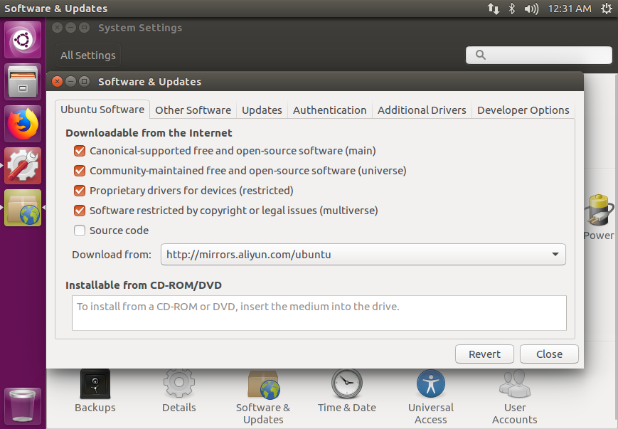
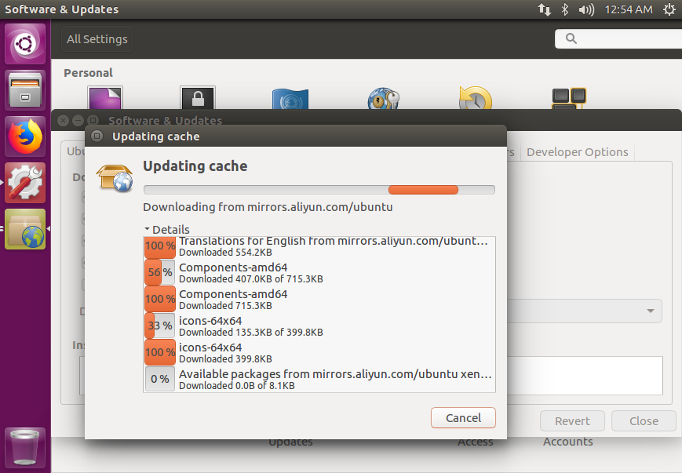
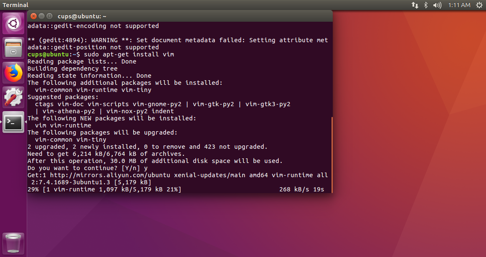

# Facric环境搭建

> 截图保存再显示，在操作上有很大困难；主要原因是烦，麻烦，不是不会。
>
> 能截图的我截图表示；一般情况下：
>
> 1.在非代码块的部分需要显示的情况下显示图片；
>
> 2.在代码块中需要显示的情况下，如下显示：
>
> ##########################################################################
>
> 要显示的命令行内容
>
> ##########################################################################
>
> 3.个人理解在（）中显示。
>
> 4.需要特别注意的在>><<中显示。

**主要过程**

1. 更换软件下载源(下载更快)。
2. 安装相关软件(为fabric的环境搭建做基础)。
3. Golang软件安装、配置全局环境变量、并验证其安装成功。
4. 安装docker-ce、配置当前用户有足够的权限使用docker、并验证docker可以正常被当前用户使用。
5. 安装docker-compose、并验证docker-compose安装成功。
6. 下载fabric代码、使用代码中的脚本下载fabric示例和fabric镜像。
7. 运行示例代码中的first-network网络。

## 操作系统：ubuntu 1.6.04

### 更换软件源

我们知道当我们下载软件时使用越靠近主机的源，其下载速度越快。

从ubuntu官网下载软件，下载速度异常缓慢。

不更换源，需要半天或者1天左右的时间把fabric的景象下载完；更换源30分钟就足够用了。

> 若有可视化界面。
>
> System Settings>>Software & Updates>>download from>>Server for United States>>Others>>http://mmirrors.aliyun.com/ubuntu>>输入管理员密码(弹出需要管理员权限的对话框)>>close>>Reload





> 若无可视化界面。
>
> 可以更改软件源的地址的配置文件，其路径在/etc/apt/sources.list

```shell
# 复制一份，好出现问题能恢复
sudo cp /etc/apt/sources.list /etc/apt/sources.list.bak

# 使用vi打开/etc/apt/sources.list文件
sudo vi /etc/apt/sources.list					# 或者使用 gedit、vim等

# 删除原文件中的所有内容，并写入（阿里云的源）
deb http://mirrors.aliyun.com/ubuntu/ xenial main restricted
deb http://mirrors.aliyun.com/ubuntu/ xenial-updates main restricted
deb http://mirrors.aliyun.com/ubuntu/ xenial universe
deb http://mirrors.aliyun.com/ubuntu/ xenial-updates universe
deb http://mirrors.aliyun.com/ubuntu/ xenial multiverse
deb http://mirrors.aliyun.com/ubuntu/ xenial-updates multiverse
deb http://mirrors.aliyun.com/ubuntu/ xenial-backports main restricted universe multiverse
deb http://mirrors.aliyun.com/ubuntu/ xenial-security main restricted
deb http://mirrors.aliyun.com/ubuntu/ xenial-security universe
deb http://mirrors.aliyun.com/ubuntu/ xenial-security multiverse

# 更新源
sudo apt-get update

# >>习惯性使用阿里的源；其他源可能行；我没有试过。在这里仅写出阿里云<<
```

### 下载相关软件

```shell
# 安装vim
sudo apt-get install vim

# 安装git
sudo apt-get install git

# 安装curl
sudo apt-get install curl

# 安装wget
sudo apt-get install wget

# 当挺下时输入y即可
```



> vim: vim是一个类似于Vi的著名的功能强大、高度可定制的文本编辑器，在Vi的基础上改进和增加了很多特性。
>
> git: git(读音为/gɪt/。)是一个开源的分布式版本控制系统，可以有效、高速地处理从很小到非常大的项目版本管理。Git 是Linus Torvalds 为了帮助管理 Linux 内核开发而开发的一个开放源码的版本控制软件。
>
> curl: cURL是一个利用URL语法在命令行下工作的文件传输工具，1997年首次发行。它支持文件上传和下载，所以是综合传输工具，但按传统，习惯称cURL为下载工具。
>
> wget: wget 是一个从网络上自动下载文件的自由工具，支持通过 HTTP、HTTPS、FTP 三个最常见的 TCP/IP协议下载，并可以使用 HTTP 代理。"wget" 这个名称来源于 “World Wide Web” 与 “get” 的结合。所谓自动下载，是指 wget 可以在用户退出系统的之后在继续后台执行，直到下载任务完成。

### golang的安装

```shell
# >>在这一步中，环境配置容易出错。新手请按本文一步一步来。<<
# 切换到根目录
cd ~

# 下载golang安装包
> 1.在虚拟机中进行下载时，请使用手机热点网络；校园网下载不了。
>>>>若问为什么,我也不知道。类似于，校园网下梯子不能用；移动网络就可以去看南方公园了。
> 2.对云服务器部署时，先将golang安装包下载到本地；ftp上传服务器；接下来就相同了。
> 3.百度云下载地址
>>>>链接：https://pan.baidu.com/s/1E69xnu_NH6YZqZ2CbSfP1g 提取码：1pss
wget https://studygolang.com/dl/golang/go1.11.linux-amd64.tar.gz

# 解压
tar -xzf go1.11.linux-amd64.tar.gz

# 移动(我个人的理解是：软件要放到一个习惯性的文件夹中，如：win7下我的软件)
sudo mv go /usr/local
```

### Go环境变量配置

```shell
# 打开环境变量配置文件
sudo gedit /etc/profile 			# 或者vim；sudo vim /etc/profile

# 在其原有内容的后边添加如下内容(个人理解：类似于java环境变量的配置)
# >>注意保存退出<<
export  PATH=$PATH:/usr/local/go/bin
export  GOROOT=/usr/local/go
export  GOPATH=$HOME/go
export  PATH=$PATH:$HOME/go/bin

# >>重启电脑或者退出当前用户再重新登录<<
# (退出当前用户，重启就可以使环境变量在每个用户每次登录是生效)

# 查看go的环境变量
go env
######################################################################################
cups@ubuntu:~$ go env
GOARCH="amd64"
GOBIN=""
GOCACHE="/home/cups/.cache/go-build"
GOEXE=""
GOFLAGS=""
GOHOSTARCH="amd64"
GOHOSTOS="linux"
GOOS="linux"
GOPATH="/home/cups/go"
GOPROXY=""
GORACE=""
GOROOT="/usr/local/go"
GOTMPDIR=""
GOTOOLDIR="/usr/local/go/pkg/tool/linux_amd64"
GCCGO="gccgo"
CC="gcc"
CXX="g++"
CGO_ENABLED="1"
GOMOD=""
CGO_CFLAGS="-g -O2"
CGO_CPPFLAGS=""
CGO_CXXFLAGS="-g -O2"
CGO_FFLAGS="-g -O2"
CGO_LDFLAGS="-g -O2"
PKG_CONFIG="pkg-config"
GOGCCFLAGS="-fPIC -m64 -pthread -fmessage-length=0 -fdebug-prefix-map=/tmp/go-build181809972=/tmp/go-build -gno-record-gcc-switches"
cups@ubuntu:~$ 
######################################################################################

# 查看go的版本
go version														# go环境安装成功
######################################################################################
cups@ubuntu:~$ go version
go version go1.11 linux/amd64
cups@ubuntu:~$ 
######################################################################################
```

### Dokcer安装

```shell
# 卸载旧版本(这一步要养成习惯；docker版本和docker镜像之间是由一定关系的。不卸载旧版本容易出问题；就算没
# 有旧版本也要运行一次，以防止出现问题)
sudo apt-get remove docker docker-engine docker.io
######################################################################################
cups@ubuntu:~$ sudo apt-get remove docker docker-engine docker.io
[sudo] password for cups: 
Reading package lists... Done
Building dependency tree       
Reading state information... Done
Package 'docker-engine' is not installed, so not removed
Package 'docker' is not installed, so not removed
Package 'docker.io' is not installed, so not removed
######################################################################################

# 下载安装工具(个人的理解是：像环境依赖一样；安装android studio必须先安装java)
sudo apt-get install \
    apt-transport-https \
    ca-certificates \
    software-properties-common
######################################################################################
sudo apt-get install \
>     apt-transport-https \
>     ca-certificates \
>     software-properties-common
Reading package lists... Done
Building dependency tree       
Reading state information... Done
The following additional packages will be installed:
  python3-software-properties software-properties-gtk
The following packages will be upgraded:
  apt-transport-https ca-certificates python3-software-properties
  software-properties-common software-properties-gtk
5 upgraded, 0 newly installed, 0 to remove and 416 not upgraded.
Need to get 270 kB of archives.
After this operation, 1,024 B of additional disk space will be used.
Do you want to continue? [Y/n] y
Get:1 http://mirrors.aliyun.com/ubuntu xenial-updates/main amd64 apt-transport-https amd64 1.2.32 [26.5 kB]
Get:2 http://mirrors.aliyun.com/ubuntu xenial-updates/main amd64 ca-certificates all 20170717~16.04.2 [167 kB]
Get:3 http://mirrors.aliyun.com/ubuntu xenial-updates/main amd64 software-properties-common all 0.96.20.9 [9,452 B]
Get:4 http://mirrors.aliyun.com/ubuntu xenial-updates/main amd64 software-properties-gtk all 0.96.20.9 [47.2 kB]
Get:5 http://mirrors.aliyun.com/ubuntu xenial-updates/main amd64 python3-software-properties all 0.96.20.9 [20.1 kB]
Fetched 270 kB in 2s (93.8 kB/s)                  
Preconfiguring packages ...
(Reading database ... 179796 files and directories currently installed.)
Preparing to unpack .../apt-transport-https_1.2.32_amd64.deb ...
Unpacking apt-transport-https (1.2.32) over (1.2.27) ...
Preparing to unpack .../ca-certificates_20170717~16.04.2_all.deb ...
Unpacking ca-certificates (20170717~16.04.2) over (20170717~16.04.1) ...
Preparing to unpack .../software-properties-common_0.96.20.9_all.deb ...
Unpacking software-properties-common (0.96.20.9) over (0.96.20.7) ...
Preparing to unpack .../software-properties-gtk_0.96.20.9_all.deb ...
Unpacking software-properties-gtk (0.96.20.9) over (0.96.20.7) ...
Preparing to unpack .../python3-software-properties_0.96.20.9_all.deb ...
Unpacking python3-software-properties (0.96.20.9) over (0.96.20.7) ...
Processing triggers for man-db (2.7.5-1) ...
Processing triggers for dbus (1.10.6-1ubuntu3.3) ...
Processing triggers for hicolor-icon-theme (0.15-0ubuntu1.1) ...
Processing triggers for shared-mime-info (1.5-2ubuntu0.2) ...
Processing triggers for gnome-menus (3.13.3-6ubuntu3.1) ...
Processing triggers for desktop-file-utils (0.22-1ubuntu5.2) ...
Processing triggers for bamfdaemon (0.5.3~bzr0+16.04.20180209-0ubuntu1) ...
Rebuilding /usr/share/applications/bamf-2.index...
Processing triggers for mime-support (3.59ubuntu1) ...
Setting up apt-transport-https (1.2.32) ...
Setting up ca-certificates (20170717~16.04.2) ...
Setting up python3-software-properties (0.96.20.9) ...
Setting up software-properties-common (0.96.20.9) ...
Setting up software-properties-gtk (0.96.20.9) ...
Processing triggers for ca-certificates (20170717~16.04.2) ...
Updating certificates in /etc/ssl/certs...
0 added, 0 removed; done.
Running hooks in /etc/ca-certificates/update.d...
######################################################################################

# 添加官方密钥(个人的理解是；虽然是开源软件；也要有秘钥以保障安全性)
curl -fsSL https://download.docker.com/linux/ubuntu/gpg | sudo apt-key add -
######################################################################################
cups@ubuntu:~$ curl -fsSL https://download.docker.com/linux/ubuntu/gpg | sudo apt-key add -
OK
######################################################################################

# 加入 apt 仓库中
sudo add-apt-repository \
   "deb [arch=amd64] https://download.docker.com/linux/ubuntu \
   $(lsb_release -cs) \
   stable"
######################################################################################
cups@ubuntu:~$ sudo add-apt-repository \
>    "deb [arch=amd64] https://download.docker.com/linux/ubuntu \
>    $(lsb_release -cs) \
>    stable"
cups@ubuntu:~$
######################################################################################

# 下载docker-ce
sudo apt-get update												# 更新apt-get
sudo apt-get install docker-ce									# 下载最新的docker-ce
######################################################################################
cups@ubuntu:~$ sudo apt-get update
Hit:1 http://mirrors.aliyun.com/ubuntu xenial InRelease
Hit:2 http://mirrors.aliyun.com/ubuntu xenial-updates InRelease                
Hit:3 http://mirrors.aliyun.com/ubuntu xenial-backports InRelease              
Get:4 https://download.docker.com/linux/ubuntu xenial InRelease [66.2 kB]      
Hit:5 http://mirrors.aliyun.com/ubuntu xenial-security InRelease               
Get:6 https://download.docker.com/linux/ubuntu xenial/stable amd64 Packages [10.7 kB]
Fetched 76.9 kB in 5s (14.8 kB/s)
Reading package lists... Done
cups@ubuntu:~$ sudo apt-get install docker-ce
Reading package lists... Done
Building dependency tree       
Reading state information... Done
The following additional packages will be installed:
  aufs-tools cgroupfs-mount containerd.io docker-ce-cli pigz
The following NEW packages will be installed:
  aufs-tools cgroupfs-mount containerd.io docker-ce docker-ce-cli pigz
0 upgraded, 6 newly installed, 0 to remove and 416 not upgraded.
Need to get 87.6 MB/87.7 MB of archives.
After this operation, 390 MB of additional disk space will be used.
Do you want to continue? [Y/n] y
Get:1 https://download.docker.com/linux/ubuntu xenial/stable amd64 containerd.io amd64 1.2.6-3 [22.6 MB]
Get:2 https://download.docker.com/linux/ubuntu xenial/stable amd64 docker-ce-cli amd64 5:19.03.2~3-0~ubuntu-xenial [42.3 MB]
Get:3 https://download.docker.com/linux/ubuntu xenial/stable amd64 docker-ce amd64 5:19.03.2~3-0~ubuntu-xenial [22.7 MB]
Fetched 87.6 MB in 4min 46s (306 kB/s)                                         
Selecting previously unselected package pigz.
(Reading database ... 179796 files and directories currently installed.)
Preparing to unpack .../pigz_2.3.1-2_amd64.deb ...
Unpacking pigz (2.3.1-2) ...
Selecting previously unselected package aufs-tools.
Preparing to unpack .../aufs-tools_1%3a3.2+20130722-1.1ubuntu1_amd64.deb ...
Unpacking aufs-tools (1:3.2+20130722-1.1ubuntu1) ...
Selecting previously unselected package cgroupfs-mount.
Preparing to unpack .../cgroupfs-mount_1.2_all.deb ...
Unpacking cgroupfs-mount (1.2) ...
Selecting previously unselected package containerd.io.
Preparing to unpack .../containerd.io_1.2.6-3_amd64.deb ...
Unpacking containerd.io (1.2.6-3) ...
Selecting previously unselected package docker-ce-cli.
Preparing to unpack .../docker-ce-cli_5%3a19.03.2~3-0~ubuntu-xenial_amd64.deb ...
Unpacking docker-ce-cli (5:19.03.2~3-0~ubuntu-xenial) ...
Selecting previously unselected package docker-ce.
Preparing to unpack .../docker-ce_5%3a19.03.2~3-0~ubuntu-xenial_amd64.deb ...
Unpacking docker-ce (5:19.03.2~3-0~ubuntu-xenial) ...
Processing triggers for man-db (2.7.5-1) ...
Processing triggers for libc-bin (2.23-0ubuntu10) ...
Processing triggers for ureadahead (0.100.0-19) ...
Processing triggers for systemd (229-4ubuntu21.4) ...
Setting up pigz (2.3.1-2) ...
Setting up aufs-tools (1:3.2+20130722-1.1ubuntu1) ...
Setting up cgroupfs-mount (1.2) ...
Setting up containerd.io (1.2.6-3) ...
Setting up docker-ce-cli (5:19.03.2~3-0~ubuntu-xenial) ...
Setting up docker-ce (5:19.03.2~3-0~ubuntu-xenial) ...
Processing triggers for libc-bin (2.23-0ubuntu10) ...
Processing triggers for systemd (229-4ubuntu21.4) ...
Processing triggers for ureadahead (0.100.0-19) ...
cups@ubuntu:~$ 
######################################################################################

# 检查docker版本（我们可以看出，需要获得docker的使用权限）
docker version
######################################################################################
cups@ubuntu:~$ docker version
Client: Docker Engine - Community
 Version:           19.03.2
 API version:       1.40
 Go version:        go1.12.8
 Git commit:        6a30dfc
 Built:             Thu Aug 29 05:28:19 2019
 OS/Arch:           linux/amd64
 Experimental:      false
Got permission denied while trying to connect to the Docker daemon socket at unix:///var/run/docker.sock: Get http://%2Fvar%2Frun%2Fdocker.sock/v1.40/version: dial unix /var/run/docker.sock: connect: permission denied
cups@ubuntu:~$ 
######################################################################################

# 为当前用户获取docker使用权限
sudo usermod -aG docker XXX(XXX是当前用户名)
######################################################################################
cups@ubuntu:~$ sudo usermod -aG docker cups
cups@ubuntu:~$ 
######################################################################################

# 添加阿里云的Docker镜像：(类似与配置文件的配置；嗯，很像环境变量的配置；只不过是用途不同)
sudo mkdir -p /etc/docker     
sudo gedit /etc/docker/daemon.json
# 写入
{
 "registry-mirrors": ["https://obou6wyb.mirror.aliyuncs.com"]
}

# 重启docker(改了东西当然要从新加载；可以看出还是缺少权限；缺少var/run/docker.sock的使用权)
sudo systemctl daemon-reload 
sudo systemctl restart docker 
docker version
######################################################################################
cups@ubuntu:~$ sudo systemctl daemon-reload
cups@ubuntu:~$ sudo systemctl restart docker 
cups@ubuntu:~$ docker version
Client: Docker Engine - Community
 Version:           19.03.2
 API version:       1.40
 Go version:        go1.12.8
 Git commit:        6a30dfc
 Built:             Thu Aug 29 05:28:19 2019
 OS/Arch:           linux/amd64
 Experimental:      false
Got permission denied while trying to connect to the Docker daemon socket at unix:///var/run/docker.sock: Get http://%2Fvar%2Frun%2Fdocker.sock/v1.40/version: dial unix /var/run/docker.sock: connect: permission denied
cups@ubuntu:~$ 
######################################################################################

# 获得docker文件使用权限(我只知道777是可读可写可执行；其他的就不懂了)
sudo chmod -R 777 /var/run/docker.sock
docker version									# (docker可以正常使用)
######################################################################################
cups@ubuntu:~$ sudo chmod -R 777 /var/run/docker.sock
cups@ubuntu:~$ docker version
Client: Docker Engine - Community
 Version:           19.03.2
 API version:       1.40
 Go version:        go1.12.8
 Git commit:        6a30dfc
 Built:             Thu Aug 29 05:28:19 2019
 OS/Arch:           linux/amd64
 Experimental:      false

Server: Docker Engine - Community
 Engine:
  Version:          19.03.2
  API version:      1.40 (minimum version 1.12)
  Go version:       go1.12.8
  Git commit:       6a30dfc
  Built:            Thu Aug 29 05:26:54 2019
  OS/Arch:          linux/amd64
  Experimental:     false
 containerd:
  Version:          1.2.6
  GitCommit:        894b81a4b802e4eb2a91d1ce216b8817763c29fb
 runc:
  Version:          1.0.0-rc8
  GitCommit:        425e105d5a03fabd737a126ad93d62a9eeede87f
 docker-init:
  Version:          0.18.0
  GitCommit:        fec3683
cups@ubuntu:~$ 
######################################################################################
```

### docker-compose安装

```shell
# 安装python-pip (python包管理工具；类似于apt-get；使用时的命令是pip .....)
sudo apt-get install python-pip
######################################################################################
cups@ubuntu:~$ sudo apt-get install python-pip
Reading package lists... Done
Building dependency tree       
Reading state information... Done
The following additional packages will be installed:
  libexpat1 libexpat1-dev libpython-all-dev libpython-dev libpython2.7
  libpython2.7-dev libpython2.7-minimal libpython2.7-stdlib python-all
  python-all-dev python-dev python-pip-whl python-pkg-resources
  python-setuptools python-wheel python2.7 python2.7-dev python2.7-minimal
Suggested packages:
  python-setuptools-doc python2.7-doc binfmt-support
The following NEW packages will be installed:
  libexpat1-dev libpython-all-dev libpython-dev libpython2.7-dev python-all
  python-all-dev python-dev python-pip python-pip-whl python-pkg-resources
  python-setuptools python-wheel python2.7-dev
The following packages will be upgraded:
  libexpat1 libpython2.7 libpython2.7-minimal libpython2.7-stdlib python2.7
  python2.7-minimal
6 upgraded, 13 newly installed, 0 to remove and 410 not upgraded.
Need to get 29.8 MB/34.6 MB of archives.
After this operation, 45.1 MB of additional disk space will be used.
Do you want to continue? [Y/n] y
Get:1 http://mirrors.aliyun.com/ubuntu xenial-updates/main amd64 libexpat1-dev amd64 2.1.0-7ubuntu0.16.04.5 [115 kB]
Get:2 http://mirrors.aliyun.com/ubuntu xenial-updates/main amd64 libpython2.7-dev amd64 2.7.12-1ubuntu0~16.04.8 [27.8 MB]
Get:3 http://mirrors.aliyun.com/ubuntu xenial-updates/main amd64 libpython-dev amd64 2.7.12-1~16.04 [7,840 B]
Get:4 http://mirrors.aliyun.com/ubuntu xenial-updates/main amd64 libpython-all-dev amd64 2.7.12-1~16.04 [1,006 B]
Get:5 http://mirrors.aliyun.com/ubuntu xenial-updates/main amd64 python-all amd64 2.7.12-1~16.04 [996 B]
Get:6 http://mirrors.aliyun.com/ubuntu xenial-updates/main amd64 python2.7-dev amd64 2.7.12-1ubuntu0~16.04.8 [276 kB]
Get:7 http://mirrors.aliyun.com/ubuntu xenial-updates/main amd64 python-dev amd64 2.7.12-1~16.04 [1,186 B]
Get:8 http://mirrors.aliyun.com/ubuntu xenial-updates/main amd64 python-all-dev amd64 2.7.12-1~16.04 [1,016 B]
Get:9 http://mirrors.aliyun.com/ubuntu xenial-updates/universe amd64 python-pip-whl all 8.1.1-2ubuntu0.4 [1,110 kB]
Get:10 http://mirrors.aliyun.com/ubuntu xenial-updates/universe amd64 python-pip all 8.1.1-2ubuntu0.4 [144 kB]
Get:11 http://mirrors.aliyun.com/ubuntu xenial/main amd64 python-pkg-resources all 20.7.0-1 [108 kB]
Get:12 http://mirrors.aliyun.com/ubuntu xenial/main amd64 python-setuptools all 20.7.0-1 [169 kB]
Get:13 http://mirrors.aliyun.com/ubuntu xenial/universe amd64 python-wheel all 0.29.0-1 [48.0 kB]
Fetched 29.8 MB in 24s (1,203 kB/s)                                            
(Reading database ... 180094 files and directories currently installed.)
Preparing to unpack .../python2.7_2.7.12-1ubuntu0~16.04.8_amd64.deb ...
Unpacking python2.7 (2.7.12-1ubuntu0~16.04.8) over (2.7.12-1ubuntu0~16.04.3) ...
Preparing to unpack .../libpython2.7_2.7.12-1ubuntu0~16.04.8_amd64.deb ...
Unpacking libpython2.7:amd64 (2.7.12-1ubuntu0~16.04.8) over (2.7.12-1ubuntu0~16.04.3) ...
Preparing to unpack .../libexpat1_2.1.0-7ubuntu0.16.04.5_amd64.deb ...
Unpacking libexpat1:amd64 (2.1.0-7ubuntu0.16.04.5) over (2.1.0-7ubuntu0.16.04.3) ...
Preparing to unpack .../libpython2.7-stdlib_2.7.12-1ubuntu0~16.04.8_amd64.deb ...
Unpacking libpython2.7-stdlib:amd64 (2.7.12-1ubuntu0~16.04.8) over (2.7.12-1ubuntu0~16.04.3) ...
Preparing to unpack .../python2.7-minimal_2.7.12-1ubuntu0~16.04.8_amd64.deb ...
Unpacking python2.7-minimal (2.7.12-1ubuntu0~16.04.8) over (2.7.12-1ubuntu0~16.04.3) ...
Preparing to unpack .../libpython2.7-minimal_2.7.12-1ubuntu0~16.04.8_amd64.deb ...
Unpacking libpython2.7-minimal:amd64 (2.7.12-1ubuntu0~16.04.8) over (2.7.12-1ubuntu0~16.04.3) ...
Selecting previously unselected package libexpat1-dev:amd64.
Preparing to unpack .../libexpat1-dev_2.1.0-7ubuntu0.16.04.5_amd64.deb ...
Unpacking libexpat1-dev:amd64 (2.1.0-7ubuntu0.16.04.5) ...
Selecting previously unselected package libpython2.7-dev:amd64.
Preparing to unpack .../libpython2.7-dev_2.7.12-1ubuntu0~16.04.8_amd64.deb ...
Unpacking libpython2.7-dev:amd64 (2.7.12-1ubuntu0~16.04.8) ...
Selecting previously unselected package libpython-dev:amd64.
Preparing to unpack .../libpython-dev_2.7.12-1~16.04_amd64.deb ...
Unpacking libpython-dev:amd64 (2.7.12-1~16.04) ...
Selecting previously unselected package libpython-all-dev:amd64.
Preparing to unpack .../libpython-all-dev_2.7.12-1~16.04_amd64.deb ...
Unpacking libpython-all-dev:amd64 (2.7.12-1~16.04) ...
Selecting previously unselected package python-all.
Preparing to unpack .../python-all_2.7.12-1~16.04_amd64.deb ...
Unpacking python-all (2.7.12-1~16.04) ...
Selecting previously unselected package python2.7-dev.
Preparing to unpack .../python2.7-dev_2.7.12-1ubuntu0~16.04.8_amd64.deb ...
Unpacking python2.7-dev (2.7.12-1ubuntu0~16.04.8) ...
Selecting previously unselected package python-dev.
Preparing to unpack .../python-dev_2.7.12-1~16.04_amd64.deb ...
Unpacking python-dev (2.7.12-1~16.04) ...
Selecting previously unselected package python-all-dev.
Preparing to unpack .../python-all-dev_2.7.12-1~16.04_amd64.deb ...
Unpacking python-all-dev (2.7.12-1~16.04) ...
Selecting previously unselected package python-pip-whl.
Preparing to unpack .../python-pip-whl_8.1.1-2ubuntu0.4_all.deb ...
Unpacking python-pip-whl (8.1.1-2ubuntu0.4) ...
Selecting previously unselected package python-pip.
Preparing to unpack .../python-pip_8.1.1-2ubuntu0.4_all.deb ...
Unpacking python-pip (8.1.1-2ubuntu0.4) ...
Selecting previously unselected package python-pkg-resources.
Preparing to unpack .../python-pkg-resources_20.7.0-1_all.deb ...
Unpacking python-pkg-resources (20.7.0-1) ...
Selecting previously unselected package python-setuptools.
Preparing to unpack .../python-setuptools_20.7.0-1_all.deb ...
Unpacking python-setuptools (20.7.0-1) ...
Selecting previously unselected package python-wheel.
Preparing to unpack .../python-wheel_0.29.0-1_all.deb ...
Unpacking python-wheel (0.29.0-1) ...
Processing triggers for gnome-menus (3.13.3-6ubuntu3.1) ...
Processing triggers for desktop-file-utils (0.22-1ubuntu5.2) ...
Processing triggers for bamfdaemon (0.5.3~bzr0+16.04.20180209-0ubuntu1) ...
Rebuilding /usr/share/applications/bamf-2.index...
Processing triggers for mime-support (3.59ubuntu1) ...
Processing triggers for man-db (2.7.5-1) ...
Processing triggers for libc-bin (2.23-0ubuntu10) ...
Processing triggers for doc-base (0.10.7) ...
Processing 1 added doc-base file...
Setting up libpython2.7-minimal:amd64 (2.7.12-1ubuntu0~16.04.8) ...
Setting up python2.7-minimal (2.7.12-1ubuntu0~16.04.8) ...
Setting up libexpat1:amd64 (2.1.0-7ubuntu0.16.04.5) ...
Setting up libpython2.7-stdlib:amd64 (2.7.12-1ubuntu0~16.04.8) ...
Setting up python2.7 (2.7.12-1ubuntu0~16.04.8) ...
Setting up libpython2.7:amd64 (2.7.12-1ubuntu0~16.04.8) ...
Setting up libexpat1-dev:amd64 (2.1.0-7ubuntu0.16.04.5) ...
Setting up libpython2.7-dev:amd64 (2.7.12-1ubuntu0~16.04.8) ...
Setting up libpython-dev:amd64 (2.7.12-1~16.04) ...
Setting up libpython-all-dev:amd64 (2.7.12-1~16.04) ...
Setting up python-all (2.7.12-1~16.04) ...
Setting up python2.7-dev (2.7.12-1ubuntu0~16.04.8) ...
Setting up python-dev (2.7.12-1~16.04) ...
Setting up python-all-dev (2.7.12-1~16.04) ...
Setting up python-pip-whl (8.1.1-2ubuntu0.4) ...
Setting up python-pip (8.1.1-2ubuntu0.4) ...
Setting up python-pkg-resources (20.7.0-1) ...
Setting up python-setuptools (20.7.0-1) ...
Setting up python-wheel (0.29.0-1) ...
Processing triggers for libc-bin (2.23-0ubuntu10) ...
cups@ubuntu:~$ 
######################################################################################

# 安装docker-compose(docker镜像管理工具)
sudo pip install docker-compose
# >>这里容易出错,这种错误和fabirc没有任何关系；只是简单的ubuntu错误<<
# >>在文档编写时出现如下错误；嗯，不知道啥错误；但该错误肯定和pip有关系；因为docker-ce没有问题<<
# >>docker-compose的安装是和pip有直接关系的；pip出错之后；常见操作是更新pip；再来一次<<
######################################################################################
cups@ubuntu:~$ sudo pip install docker-compose
The directory '/home/cups/.cache/pip/http' or its parent directory is not owned by the current user and the cache has been disabled. Please check the permissions and owner of that directory. If executing pip with sudo, you may want sudo's -H flag.
The directory '/home/cups/.cache/pip' or its parent directory is not owned by the current user and caching wheels has been disabled. check the permissions and owner of that directory. If executing pip with sudo, you may want sudo's -H flag.
Collecting docker-compose
Exception:
Traceback (most recent call last):
  File "/usr/lib/python2.7/dist-packages/pip/basecommand.py", line 209, in main
    status = self.run(options, args)
  File "/usr/lib/python2.7/dist-packages/pip/commands/install.py", line 317, in run
    requirement_set.prepare_files(finder)
  File "/usr/lib/python2.7/dist-packages/pip/req/req_set.py", line 360, in prepare_files
    ignore_dependencies=self.ignore_dependencies))
  File "/usr/lib/python2.7/dist-packages/pip/req/req_set.py", line 577, in _prepare_file
    session=self.session, hashes=hashes)
  File "/usr/lib/python2.7/dist-packages/pip/download.py", line 810, in unpack_url
    hashes=hashes
  File "/usr/lib/python2.7/dist-packages/pip/download.py", line 649, in unpack_http_url
    hashes)
  File "/usr/lib/python2.7/dist-packages/pip/download.py", line 842, in _download_http_url
    stream=True,
  File "/usr/share/python-wheels/requests-2.9.1-py2.py3-none-any.whl/requests/sessions.py", line 480, in get
    return self.request('GET', url, **kwargs)
  File "/usr/lib/python2.7/dist-packages/pip/download.py", line 378, in request
    return super(PipSession, self).request(method, url, *args, **kwargs)
  File "/usr/share/python-wheels/requests-2.9.1-py2.py3-none-any.whl/requests/sessions.py", line 468, in request
    resp = self.send(prep, **send_kwargs)
  File "/usr/share/python-wheels/requests-2.9.1-py2.py3-none-any.whl/requests/sessions.py", line 576, in send
    r = adapter.send(request, **kwargs)
  File "/usr/share/python-wheels/CacheControl-0.11.5-py2.py3-none-any.whl/cachecontrol/adapter.py", line 46, in send
    resp = super(CacheControlAdapter, self).send(request, **kw)
  File "/usr/share/python-wheels/requests-2.9.1-py2.py3-none-any.whl/requests/adapters.py", line 376, in send
    timeout=timeout
  File "/usr/share/python-wheels/urllib3-1.13.1-py2.py3-none-any.whl/urllib3/connectionpool.py", line 610, in urlopen
    _stacktrace=sys.exc_info()[2])
  File "/usr/share/python-wheels/urllib3-1.13.1-py2.py3-none-any.whl/urllib3/util/retry.py", line 228, in increment
    total -= 1
TypeError: unsupported operand type(s) for -=: 'Retry' and 'int'
cups@ubuntu:~$ 
######################################################################################

# 更新pip
sudo pip install --upgrade pip
sudo pip install docker-compose
######################################################################################
cups@ubuntu:~$ sudo pip install --upgrade pip
The directory '/home/cups/.cache/pip/http' or its parent directory is not owned by the current user and the cache has been disabled. Please check the permissions and owner of that directory. If executing pip with sudo, you may want sudo's -H flag.
The directory '/home/cups/.cache/pip' or its parent directory is not owned by the current user and caching wheels has been disabled. check the permissions and owner of that directory. If executing pip with sudo, you may want sudo's -H flag.
Collecting pip
  Downloading https://files.pythonhosted.org/packages/30/db/9e38760b32e3e7f40cce46dd5fb107b8c73840df38f0046d8e6514e675a1/pip-19.2.3-py2.py3-none-any.whl (1.4MB)
    100% |████████████████████████████████| 1.4MB 397kB/s 
Installing collected packages: pip
  Found existing installation: pip 8.1.1
    Not uninstalling pip at /usr/lib/python2.7/dist-packages, outside environment /usr
Successfully installed pip-19.2.3
cups@ubuntu:~$ sudo pip install docker-compose
DEPRECATION: Python 2.7 will reach the end of its life on January 1st, 2020. Please upgrade your Python as Python 2.7 won't be maintained after that date. A future version of pip will drop support for Python 2.7. More details about Python 2 support in pip, can be found at https://pip.pypa.io/en/latest/development/release-process/#python-2-support
WARNING: The directory '/home/cups/.cache/pip/http' or its parent directory is not owned by the current user and the cache has been disabled. Please check the permissions and owner of that directory. If executing pip with sudo, you may want sudo's -H flag.
WARNING: The directory '/home/cups/.cache/pip' or its parent directory is not owned by the current user and caching wheels has been disabled. check the permissions and owner of that directory. If executing pip with sudo, you may want sudo's -H flag.
Collecting docker-compose
  Downloading https://files.pythonhosted.org/packages/dd/e6/1521d1dfd9c0da1d1863b18e592d91c3df222e55f258b9876fa1e59bc4b5/docker_compose-1.24.1-py2.py3-none-any.whl (134kB)
     |████████████████████████████████| 143kB 317kB/s 
Collecting websocket-client<1.0,>=0.32.0 (from docker-compose)
  Downloading https://files.pythonhosted.org/packages/29/19/44753eab1fdb50770ac69605527e8859468f3c0fd7dc5a76dd9c4dbd7906/websocket_client-0.56.0-py2.py3-none-any.whl (200kB)
     |████████████████████████████████| 204kB 816kB/s 
Collecting backports.ssl-match-hostname>=3.5; python_version < "3.5" (from docker-compose)
  Downloading https://files.pythonhosted.org/packages/ff/2b/8265224812912bc5b7a607c44bf7b027554e1b9775e9ee0de8032e3de4b2/backports.ssl_match_hostname-3.7.0.1.tar.gz
Collecting docker[ssh]<4.0,>=3.7.0 (from docker-compose)
  Downloading https://files.pythonhosted.org/packages/09/da/7cc7ecdcd01145e9924a8ccbe9c1baf3a362fc75d4cb150676eb5231ea60/docker-3.7.3-py2.py3-none-any.whl (134kB)
     |████████████████████████████████| 143kB 860kB/s 
Collecting dockerpty<0.5,>=0.4.1 (from docker-compose)
  Downloading https://files.pythonhosted.org/packages/8d/ee/e9ecce4c32204a6738e0a5d5883d3413794d7498fe8b06f44becc028d3ba/dockerpty-0.4.1.tar.gz
Collecting ipaddress>=1.0.16; python_version < "3.3" (from docker-compose)
  Downloading https://files.pythonhosted.org/packages/fc/d0/7fc3a811e011d4b388be48a0e381db8d990042df54aa4ef4599a31d39853/ipaddress-1.0.22-py2.py3-none-any.whl
Collecting docopt<0.7,>=0.6.1 (from docker-compose)
  Downloading https://files.pythonhosted.org/packages/a2/55/8f8cab2afd404cf578136ef2cc5dfb50baa1761b68c9da1fb1e4eed343c9/docopt-0.6.2.tar.gz
Collecting PyYAML<4.3,>=3.10 (from docker-compose)
  Downloading https://files.pythonhosted.org/packages/9e/a3/1d13970c3f36777c583f136c136f804d70f500168edc1edea6daa7200769/PyYAML-3.13.tar.gz (270kB)
     |████████████████████████████████| 276kB 794kB/s 
Collecting requests!=2.11.0,!=2.12.2,!=2.18.0,<2.21,>=2.6.1 (from docker-compose)
  Downloading https://files.pythonhosted.org/packages/ff/17/5cbb026005115301a8fb2f9b0e3e8d32313142fe8b617070e7baad20554f/requests-2.20.1-py2.py3-none-any.whl (57kB)
     |████████████████████████████████| 61kB 8.0MB/s 
Collecting enum34<2,>=1.0.4; python_version < "3.4" (from docker-compose)
  Downloading https://files.pythonhosted.org/packages/c5/db/e56e6b4bbac7c4a06de1c50de6fe1ef3810018ae11732a50f15f62c7d050/enum34-1.1.6-py2-none-any.whl
Collecting texttable<0.10,>=0.9.0 (from docker-compose)
  Downloading https://files.pythonhosted.org/packages/02/e1/2565e6b842de7945af0555167d33acfc8a615584ef7abd30d1eae00a4d80/texttable-0.9.1.tar.gz
Collecting cached-property<2,>=1.2.0 (from docker-compose)
  Downloading https://files.pythonhosted.org/packages/3b/86/85c1be2e8db9e13ef9a350aecd6dea292bd612fa288c2f40d035bb750ded/cached_property-1.5.1-py2.py3-none-any.whl
Collecting jsonschema<3,>=2.5.1 (from docker-compose)
  Downloading https://files.pythonhosted.org/packages/77/de/47e35a97b2b05c2fadbec67d44cfcdcd09b8086951b331d82de90d2912da/jsonschema-2.6.0-py2.py3-none-any.whl
Collecting six<2,>=1.3.0 (from docker-compose)
  Downloading https://files.pythonhosted.org/packages/73/fb/00a976f728d0d1fecfe898238ce23f502a721c0ac0ecfedb80e0d88c64e9/six-1.12.0-py2.py3-none-any.whl
Collecting docker-pycreds>=0.4.0 (from docker[ssh]<4.0,>=3.7.0->docker-compose)
  Downloading https://files.pythonhosted.org/packages/f5/e8/f6bd1eee09314e7e6dee49cbe2c5e22314ccdb38db16c9fc72d2fa80d054/docker_pycreds-0.4.0-py2.py3-none-any.whl
Collecting paramiko>=2.4.2; extra == "ssh" (from docker[ssh]<4.0,>=3.7.0->docker-compose)
  Downloading https://files.pythonhosted.org/packages/4b/80/74dace9e48b0ef923633dfb5e48798f58a168e4734bca8ecfaf839ba051a/paramiko-2.6.0-py2.py3-none-any.whl (199kB)
     |████████████████████████████████| 204kB 807kB/s 
Collecting urllib3<1.25,>=1.21.1 (from requests!=2.11.0,!=2.12.2,!=2.18.0,<2.21,>=2.6.1->docker-compose)
  Downloading https://files.pythonhosted.org/packages/01/11/525b02e4acc0c747de8b6ccdab376331597c569c42ea66ab0a1dbd36eca2/urllib3-1.24.3-py2.py3-none-any.whl (118kB)
     |████████████████████████████████| 122kB 782kB/s 
Collecting chardet<3.1.0,>=3.0.2 (from requests!=2.11.0,!=2.12.2,!=2.18.0,<2.21,>=2.6.1->docker-compose)
  Downloading https://files.pythonhosted.org/packages/bc/a9/01ffebfb562e4274b6487b4bb1ddec7ca55ec7510b22e4c51f14098443b8/chardet-3.0.4-py2.py3-none-any.whl (133kB)
     |████████████████████████████████| 143kB 801kB/s 
Collecting idna<2.8,>=2.5 (from requests!=2.11.0,!=2.12.2,!=2.18.0,<2.21,>=2.6.1->docker-compose)
  Downloading https://files.pythonhosted.org/packages/4b/2a/0276479a4b3caeb8a8c1af2f8e4355746a97fab05a372e4a2c6a6b876165/idna-2.7-py2.py3-none-any.whl (58kB)
     |████████████████████████████████| 61kB 11.2MB/s 
Collecting certifi>=2017.4.17 (from requests!=2.11.0,!=2.12.2,!=2.18.0,<2.21,>=2.6.1->docker-compose)
  Downloading https://files.pythonhosted.org/packages/18/b0/8146a4f8dd402f60744fa380bc73ca47303cccf8b9190fd16a827281eac2/certifi-2019.9.11-py2.py3-none-any.whl (154kB)
     |████████████████████████████████| 163kB 691kB/s 
Collecting functools32; python_version == "2.7" (from jsonschema<3,>=2.5.1->docker-compose)
  Downloading https://files.pythonhosted.org/packages/c5/60/6ac26ad05857c601308d8fb9e87fa36d0ebf889423f47c3502ef034365db/functools32-3.2.3-2.tar.gz
Collecting bcrypt>=3.1.3 (from paramiko>=2.4.2; extra == "ssh"->docker[ssh]<4.0,>=3.7.0->docker-compose)
  Downloading https://files.pythonhosted.org/packages/ad/36/9a0227d048e98409f012570f7bef8a8c2373b9c9c5dfbf82963cbae05ede/bcrypt-3.1.7-cp27-cp27mu-manylinux1_x86_64.whl (59kB)
     |████████████████████████████████| 61kB 9.9MB/s 
Collecting pynacl>=1.0.1 (from paramiko>=2.4.2; extra == "ssh"->docker[ssh]<4.0,>=3.7.0->docker-compose)
  Downloading https://files.pythonhosted.org/packages/b3/25/e605574f24948a8a53b497744e93f061eb1dbe7c44b6465fc1c172d591aa/PyNaCl-1.3.0-cp27-cp27mu-manylinux1_x86_64.whl (762kB)
     |████████████████████████████████| 768kB 561kB/s 
Collecting cryptography>=2.5 (from paramiko>=2.4.2; extra == "ssh"->docker[ssh]<4.0,>=3.7.0->docker-compose)
  Downloading https://files.pythonhosted.org/packages/e6/68/50698ce24c61db7d44d93a5043c621a0ca7839d4ef9dff913e6ab465fc92/cryptography-2.7-cp27-cp27mu-manylinux1_x86_64.whl (2.3MB)
     |████████████████████████████████| 2.3MB 406kB/s 
Collecting cffi>=1.1 (from bcrypt>=3.1.3->paramiko>=2.4.2; extra == "ssh"->docker[ssh]<4.0,>=3.7.0->docker-compose)
  Downloading https://files.pythonhosted.org/packages/8d/e9/0c8afd1579e5cf7bc0f06fbcd7cdb954cbc0baadd505973949a99337da1c/cffi-1.12.3-cp27-cp27mu-manylinux1_x86_64.whl (415kB)
     |████████████████████████████████| 419kB 917kB/s 
Collecting asn1crypto>=0.21.0 (from cryptography>=2.5->paramiko>=2.4.2; extra == "ssh"->docker[ssh]<4.0,>=3.7.0->docker-compose)
  Downloading https://files.pythonhosted.org/packages/ea/cd/35485615f45f30a510576f1a56d1e0a7ad7bd8ab5ed7cdc600ef7cd06222/asn1crypto-0.24.0-py2.py3-none-any.whl (101kB)
     |████████████████████████████████| 102kB 831kB/s 
Collecting pycparser (from cffi>=1.1->bcrypt>=3.1.3->paramiko>=2.4.2; extra == "ssh"->docker[ssh]<4.0,>=3.7.0->docker-compose)
  Downloading https://files.pythonhosted.org/packages/68/9e/49196946aee219aead1290e00d1e7fdeab8567783e83e1b9ab5585e6206a/pycparser-2.19.tar.gz (158kB)
     |████████████████████████████████| 163kB 855kB/s 
Building wheels for collected packages: backports.ssl-match-hostname, dockerpty, docopt, PyYAML, texttable, functools32, pycparser
  Building wheel for backports.ssl-match-hostname (setup.py) ... done
  Created wheel for backports.ssl-match-hostname: filename=backports.ssl_match_hostname-3.7.0.1-py2.py3-none-any.whl size=7278 sha256=2e778b6954423c882096fb2cb3f5d798a8d24e91a4e8eaa8c82c2211962ae85b
  Stored in directory: /home/cups/.cache/pip/wheels/f1/ad/d7/c184cf1ef67b07f98565dc52f91ed4f9a759b7b46674b2fd76
  Building wheel for dockerpty (setup.py) ... done
  Created wheel for dockerpty: filename=dockerpty-0.4.1-cp27-none-any.whl size=15386 sha256=b6b4f144b7ea9d904e04b7d73083b62b54761ee32372d02daa5616d98d78ea86
  Stored in directory: /home/cups/.cache/pip/wheels/e5/1e/86/bd0a97a0907c6c654af654d5875d1d4383dd1f575f77cee4aa
  Building wheel for docopt (setup.py) ... done
  Created wheel for docopt: filename=docopt-0.6.2-py2.py3-none-any.whl size=19851 sha256=5de582c5a93e6bc779f835d4c6043a7ebd6ee0313ffd21c2ae0375178e7b3590
  Stored in directory: /home/cups/.cache/pip/wheels/9b/04/dd/7daf4150b6d9b12949298737de9431a324d4b797ffd63f526e
  Building wheel for PyYAML (setup.py) ... done
  Created wheel for PyYAML: filename=PyYAML-3.13-cp27-cp27mu-linux_x86_64.whl size=44183 sha256=f51f371531aa6185863f1dcf748658f2faa181580533b455f4760f5e48c3519e
  Stored in directory: /home/cups/.cache/pip/wheels/ad/da/0c/74eb680767247273e2cf2723482cb9c924fe70af57c334513f
  Building wheel for texttable (setup.py) ... done
  Created wheel for texttable: filename=texttable-0.9.1-cp27-none-any.whl size=8243 sha256=0cd7c057f20ef1f5f98ecdd3db3eb1582e0e3ada46e182a36e28403a668cf4bb
  Stored in directory: /home/cups/.cache/pip/wheels/99/1e/2b/8452d3a48dad98632787556a0f2f90d56703b39cdf7d142dd1
  Building wheel for functools32 (setup.py) ... done
  Created wheel for functools32: filename=functools32-3.2.3.post2-cp27-none-any.whl size=10939 sha256=8d5fba4f77d16021982871a92bee333481251a5c38ad907b026bcc2187fb7fda
  Stored in directory: /home/cups/.cache/pip/wheels/b5/18/32/77a1030457155606ba5e3ec3a8a57132b1a04b1c4f765177b2
  Building wheel for pycparser (setup.py) ... done
  Created wheel for pycparser: filename=pycparser-2.19-py2.py3-none-any.whl size=111944 sha256=e7524569b76f8f422a602740127d3438a220ab6fc6945ee5860e957695a15309
  Stored in directory: /home/cups/.cache/pip/wheels/f2/9a/90/de94f8556265ddc9d9c8b271b0f63e57b26fb1d67a45564511
Successfully built backports.ssl-match-hostname dockerpty docopt PyYAML texttable functools32 pycparser
Installing collected packages: six, websocket-client, backports.ssl-match-hostname, docker-pycreds, ipaddress, urllib3, chardet, idna, certifi, requests, pycparser, cffi, bcrypt, pynacl, enum34, asn1crypto, cryptography, paramiko, docker, dockerpty, docopt, PyYAML, texttable, cached-property, functools32, jsonschema, docker-compose
Successfully installed PyYAML-3.13 asn1crypto-0.24.0 backports.ssl-match-hostname-3.7.0.1 bcrypt-3.1.7 cached-property-1.5.1 certifi-2019.9.11 cffi-1.12.3 chardet-3.0.4 cryptography-2.7 docker-3.7.3 docker-compose-1.24.1 docker-pycreds-0.4.0 dockerpty-0.4.1 docopt-0.6.2 enum34-1.1.6 functools32-3.2.3.post2 idna-2.7 ipaddress-1.0.22 jsonschema-2.6.0 paramiko-2.6.0 pycparser-2.19 pynacl-1.3.0 requests-2.20.1 six-1.12.0 texttable-0.9.1 urllib3-1.24.3 websocket-client-0.56.0
cups@ubuntu:~$ 
######################################################################################

# 查看版本
docker-compose version										#(docker-compose安装完成)
######################################################################################
cups@ubuntu:~$ docker-compose version
docker-compose version 1.24.1, build 4667896
docker-py version: 3.7.3
CPython version: 2.7.12
OpenSSL version: OpenSSL 1.0.2g  1 Mar 2016
cups@ubuntu:~$ 
######################################################################################
```

### 安装fabric环境

```shell
# 回到根目录
cd ~ 

# 创建目录(目录的问题在于；大家都这样搞；官方示例也这样搞；就导致我们不知道为什么这样设置；只能在新手的时候
# 这样设置)
mkdir  -p  go/src/github.com/hyperledger

# 获取最高权限（可读可写可执行）
sudo chmod -R 777 go

# 切换到hyperledger目录
cd go/src/github.com/hyperledger
######################################################################################
cups@ubuntu:~$ mkdir  -p  go/src/github.com/hyperledger
cups@ubuntu:~$ sudo chmod -R 777 go
cups@ubuntu:~$ cd go/src/github.com/hyperledger
cups@ubuntu:~/go/src/github.com/hyperledger$ 
######################################################################################

# 下载fabric代码(这个下载时间很长；5分钟左右吧？？;推荐下载一份到本地，或者qq文件中转站;以后在其他机器
# 上搭建fabric环境时是用的到的)
sudo git clone https://github.com/hyperledger/fabric.git
######################################################################################
cups@ubuntu:~/go/src/github.com/hyperledger$ sudo git clone https://github.com/hyperledger/fabric.git
Cloning into 'fabric'...
remote: Enumerating objects: 224, done.
remote: Counting objects: 100% (224/224), done.
remote: Compressing objects: 100% (193/193), done.
remote: Total 120264 (delta 64), reused 188 (delta 28), pack-reused 120040
Receiving objects: 100% (120264/120264), 100.18 MiB | 405.00 KiB/s, done.
Resolving deltas: 100% (80895/80895), done.
Checking connectivity... done.
cups@ubuntu:~/go/src/github.com/hyperledger$ ls
fabric
cups@ubuntu:~/go/src/github.com/hyperledger$ 
######################################################################################

# 下载fabric镜像和示例代码
# >>这里需要注意；下载fabric镜像有两种方式(暂且说3种吧)<<
# >>1.sudo ./fabric/scripts/bootstrap.sh	文档采用的方式最为稳妥,使用fabric中的脚本下载镜像<<
# >>2.curl -sSL https://bit.ly/2ysbOFE | bash -s -- 1.4.0	使用curl指定下载的路径和版本<<
# >>>>我起初是使用这种方式的，在阴差阳错下没有更新源；直接使用默认的源；镜像安装成功(需要4个小时左右)<<
# >>>>后来，我们发现；我的搭建成功只是运气；后来是用的是1.方式；稳定可靠<<<
# >>3.把搭建成功的机器上的镜像打包；复制到另一台机器上<<
# >>>>这种方式，我们都在书上、博客上看到过；问题在于：内存真的不够(一个虚拟机22Gx3=66G；<<
# >>>>嗯；一会显示一下；好表示镜像很大)；<<
sudo ./fabric/scripts/bootstrap.sh
######################################################################################
cups@ubuntu:~/go/src/github.com/hyperledger$ sudo ./fabric/scripts/bootstrap.sh
./fabric/scripts/bootstrap.sh: line 179: [: too many arguments

Installing hyperledger/fabric-samples repo

===> Checking out v1.4.3 of hyperledger/fabric-samples
HEAD is now at f86ec95... [FAB-16390] Added filter for invalid transactions

Installing Hyperledger Fabric binaries

===> Downloading version 1.4.3 platform specific fabric binaries
===> Downloading:  https://nexus.hyperledger.org/content/repositories/releases/org/hyperledger/fabric/hyperledger-fabric/linux-amd64-1.4.3/hyperledger-fabric-linux-amd64-1.4.3.tar.gz
  % Total    % Received % Xferd  Average Speed   Time    Time     Time  Current
                                 Dload  Upload   Total   Spent    Left  Speed
100 52.0M  100 52.0M    0     0   199k      0  0:04:27  0:04:27 --:--:--  223k
==> Done.
===> Downloading version 1.4.3 platform specific fabric-ca-client binary
===> Downloading:  https://nexus.hyperledger.org/content/repositories/releases/org/hyperledger/fabric-ca/hyperledger-fabric-ca/linux-amd64-1.4.3/hyperledger-fabric-ca-linux-amd64-1.4.3.tar.gz
  % Total    % Received % Xferd  Average Speed   Time    Time     Time  Current
                                 Dload  Upload   Total   Spent    Left  Speed
100 6382k  100 6382k    0     0   176k      0  0:00:36  0:00:36 --:--:--  224k
==> Done.

Installing Hyperledger Fabric docker images

===> Pulling fabric Images
==> FABRIC IMAGE: peer

1.4.3: Pulling from hyperledger/fabric-peer
34667c7e4631: Pull complete 
d18d76a881a4: Pull complete 
119c7358fbfc: Pull complete 
2aaf13f3eff0: Pull complete 
3f89de4cf84b: Pull complete 
24194f819972: Pull complete 
e77eeeeb4017: Pull complete 
c3817a367815: Pull complete 
0a4827a6f447: Pull complete 
Digest: sha256:fc11964a5201fc559bcee573e601753bf6218e35ded2f5259d86bc73cdc38976
Status: Downloaded newer image for hyperledger/fabric-peer:1.4.3
docker.io/hyperledger/fabric-peer:1.4.3
==> FABRIC IMAGE: orderer

1.4.3: Pulling from hyperledger/fabric-orderer
34667c7e4631: Already exists 
d18d76a881a4: Already exists 
119c7358fbfc: Already exists 
2aaf13f3eff0: Already exists 
3f89de4cf84b: Already exists 
24194f819972: Already exists 
e77eeeeb4017: Already exists 
cbf90d453294: Pull complete 
d1cc8126a5eb: Pull complete 
Digest: sha256:efbcd38e7a09066621a16e6da0e35329c02c3491046538cfd1107a96f0c750cf
Status: Downloaded newer image for hyperledger/fabric-orderer:1.4.3
docker.io/hyperledger/fabric-orderer:1.4.3
==> FABRIC IMAGE: ccenv

1.4.3: Pulling from hyperledger/fabric-ccenv
34667c7e4631: Already exists 
d18d76a881a4: Already exists 
119c7358fbfc: Already exists 
2aaf13f3eff0: Already exists 
3f89de4cf84b: Already exists 
24194f819972: Already exists 
78e4eabd31a5: Pull complete 
c7652b6bde40: Pull complete 
b4646dd65c45: Pull complete 
5e6defad8a30: Pull complete 
c8aa1e5239b9: Pull complete 
33085cc185d4: Pull complete 
364bab88b458: Pull complete 
e45044d8c915: Pull complete 
Digest: sha256:33068b526a06eea57e131a86472f1117d8d525245ff7b66d436b18a5a53dbb4e
Status: Downloaded newer image for hyperledger/fabric-ccenv:1.4.3
docker.io/hyperledger/fabric-ccenv:1.4.3
==> FABRIC IMAGE: javaenv

1.4.3: Pulling from hyperledger/fabric-javaenv
34667c7e4631: Already exists 
d18d76a881a4: Already exists 
119c7358fbfc: Already exists 
2aaf13f3eff0: Already exists 
3f89de4cf84b: Already exists 
24194f819972: Already exists 
78e4eabd31a5: Already exists 
c7652b6bde40: Already exists 
b4646dd65c45: Already exists 
5e6defad8a30: Already exists 
3b51db4dd3fc: Pulling fs layer 
1195a10d08f4: Pulling fs layer 
a33dc4ad9d99: Pulling fs layer 
71bc90d46bc0: Pulling fs layer 
c9a727909168: Pull complete 
d194849a6ddb: Pull complete 
2739e37d469b: Pull complete 
a25784dab2ee: Pull complete 
b50f6ccc795c: Pull complete 
50ef71424dad: Pull complete 
1fbc165a673d: Pull complete 
2d20f9595f71: Pull complete 
84d902e75615: Pull complete 
44c9cc800a2b: Pull complete 
4df8a5564310: Pull complete 
b628d529037f: Pull complete 
d00c0f30c4f3: Pull complete 
249bac2a4baf: Pull complete 
a1ee2fc3de7e: Pull complete 
a34b3ee6c3ba: Pull complete 
df69c6bd4c6e: Pull complete 
11af8ee1d5f2: Pull complete 
0cc3e41444ed: Pull complete 
e7d4b5e62012: Pull complete 
98750d58be1f: Pull complete 
ee19c1b9464e: Pull complete 
73996ae3279c: Pull complete 
Digest: sha256:3370332ba1a0240ec21738ec25daab506205dbc75b4f3d001aa00acfb3aabbfe
Status: Downloaded newer image for hyperledger/fabric-javaenv:1.4.3
docker.io/hyperledger/fabric-javaenv:1.4.3
==> FABRIC IMAGE: tools

1.4.3: Pulling from hyperledger/fabric-tools
34667c7e4631: Already exists 
d18d76a881a4: Already exists 
119c7358fbfc: Already exists 
2aaf13f3eff0: Already exists 
3f89de4cf84b: Already exists 
24194f819972: Already exists 
78e4eabd31a5: Already exists 
c7652b6bde40: Already exists 
b4646dd65c45: Already exists 
5e6defad8a30: Already exists 
fb03286c5d9e: Pull complete 
e6ff93005c59: Pull complete 
07b99bcd6d6b: Pull complete 
Digest: sha256:eda7bc6d79d55bcbae248333f3275c46f57ccab610251b55f8e6845ebe8fcf52
Status: Downloaded newer image for hyperledger/fabric-tools:1.4.3
docker.io/hyperledger/fabric-tools:1.4.3
===> Pulling fabric ca Image
==> FABRIC CA IMAGE

1.4.3: Pulling from hyperledger/fabric-ca
34667c7e4631: Already exists 
d18d76a881a4: Already exists 
119c7358fbfc: Already exists 
2aaf13f3eff0: Already exists 
3f89de4cf84b: Already exists 
24194f819972: Already exists 
414a8f56afc4: Pull complete 
d5aeaa3d2858: Pull complete 
248e89bdef30: Pull complete 
8feaa797dee8: Pull complete 
93b10fe11896: Pull complete 
Digest: sha256:82a7f653ed0de520bf3ee565a07a76aac8b91ed80869b33dddfec39652c9d183
Status: Downloaded newer image for hyperledger/fabric-ca:1.4.3
docker.io/hyperledger/fabric-ca:1.4.3
===> Pulling thirdparty docker images
==> THIRDPARTY DOCKER IMAGE: couchdb

0.4.15: Pulling from hyperledger/fabric-couchdb
34667c7e4631: Already exists 
d18d76a881a4: Already exists 
119c7358fbfc: Already exists 
2aaf13f3eff0: Already exists 
3f89de4cf84b: Already exists 
24194f819972: Already exists 
78e4eabd31a5: Already exists 
c7652b6bde40: Already exists 
b4646dd65c45: Already exists 
5e6defad8a30: Already exists 
7695bf5d0b9d: Pull complete 
6d9d46f66bc3: Pull complete 
4912f1b4990a: Pull complete 
f3b174a93eea: Pull complete 
3763a939777a: Pull complete 
f293593adbb6: Pull complete 
1ae53ace804f: Pull complete 
d4aa6d764b18: Pull complete 
d747b2b30e48: Pull complete 
52cbd2253fea: Pull complete 
Digest: sha256:f6c724592abf9c2b35d2f4cd6a7afcde9c1052cfed61560b20ef9e2e927d1790
Status: Downloaded newer image for hyperledger/fabric-couchdb:0.4.15
docker.io/hyperledger/fabric-couchdb:0.4.15
==> THIRDPARTY DOCKER IMAGE: kafka

0.4.15: Pulling from hyperledger/fabric-kafka
34667c7e4631: Already exists 
d18d76a881a4: Already exists 
119c7358fbfc: Already exists 
2aaf13f3eff0: Already exists 
3f89de4cf84b: Already exists 
24194f819972: Already exists 
78e4eabd31a5: Already exists 
c7652b6bde40: Already exists 
b4646dd65c45: Already exists 
5e6defad8a30: Already exists 
d0459116a54a: Pull complete 
1bbcec7bfdef: Pull complete 
5911218c5933: Pull complete 
Digest: sha256:62418a885c291830510379d9eb09fbdd3d397052d916ed877a468b0e2026b9e3
Status: Downloaded newer image for hyperledger/fabric-kafka:0.4.15
docker.io/hyperledger/fabric-kafka:0.4.15
==> THIRDPARTY DOCKER IMAGE: zookeeper

0.4.15: Pulling from hyperledger/fabric-zookeeper
34667c7e4631: Already exists 
d18d76a881a4: Already exists 
119c7358fbfc: Already exists 
2aaf13f3eff0: Already exists 
3f89de4cf84b: Already exists 
24194f819972: Already exists 
78e4eabd31a5: Already exists 
c7652b6bde40: Already exists 
b4646dd65c45: Already exists 
5e6defad8a30: Already exists 
0e045d9c2cdc: Pull complete 
7ef4d8920518: Pull complete 
dbeed81d9a45: Pull complete 
aeea025ecc4e: Pull complete 
Digest: sha256:180553e88d09167370aa62a41587a9a95b819b981ad74cad218689412b85f130
Status: Downloaded newer image for hyperledger/fabric-zookeeper:0.4.15
docker.io/hyperledger/fabric-zookeeper:0.4.15

===> List out hyperledger docker images
hyperledger/fabric-tools       1.4.3               18ed4db0cd57        4 weeks ago         1.55GB
hyperledger/fabric-tools       latest              18ed4db0cd57        4 weeks ago         1.55GB
hyperledger/fabric-ca          1.4.3               c18a0d3cc958        4 weeks ago         253MB
hyperledger/fabric-ca          latest              c18a0d3cc958        4 weeks ago         253MB
hyperledger/fabric-ccenv       1.4.3               3d31661a812a        4 weeks ago         1.45GB
hyperledger/fabric-ccenv       latest              3d31661a812a        4 weeks ago         1.45GB
hyperledger/fabric-orderer     1.4.3               b666a6ebbe09        4 weeks ago         173MB
hyperledger/fabric-orderer     latest              b666a6ebbe09        4 weeks ago         173MB
hyperledger/fabric-peer        1.4.3               fa87ccaed0ef        4 weeks ago         179MB
hyperledger/fabric-peer        latest              fa87ccaed0ef        4 weeks ago         179MB
hyperledger/fabric-javaenv     1.4.3               5ba5ba09db8f        8 weeks ago         1.76GB
hyperledger/fabric-javaenv     latest              5ba5ba09db8f        8 weeks ago         1.76GB
hyperledger/fabric-zookeeper   0.4.15              20c6045930c8        6 months ago        1.43GB
hyperledger/fabric-zookeeper   latest              20c6045930c8        6 months ago        1.43GB
hyperledger/fabric-kafka       0.4.15              b4ab82bbaf2f        6 months ago        1.44GB
hyperledger/fabric-kafka       latest              b4ab82bbaf2f        6 months ago        1.44GB
hyperledger/fabric-couchdb     0.4.15              8de128a55539        6 months ago        1.5GB
hyperledger/fabric-couchdb     latest              8de128a55539        6 months ago        1.5GB
cups@ubuntu:~/go/src/github.com/hyperledger$ 
######################################################################################

# 获取fabric-samples使用权(刚开始是要对配置文件不断修改的；只有root可改显然不合适)
sudo chmod -R 777 fabric-samples

# 切到first-network目录下
cd fabric-samples/first-network
######################################################################################
cups@ubuntu:~/go/src/github.com/hyperledger$ ls
fabric  fabric-samples
cups@ubuntu:~/go/src/github.com/hyperledger$ cd fabric-samples/
cups@ubuntu:~/go/src/github.com/hyperledger/fabric-samples$ ls
balance-transfer          commercial-paper  interest_rate_swaps
basic-network             config            Jenkinsfile
bin                       CONTRIBUTING.md   LICENSE
chaincode                 docs              MAINTAINERS.md
chaincode-docker-devmode  fabcar            off_chain_data
ci.properties             first-network     README.md
CODE_OF_CONDUCT.md        high-throughput   scripts
cups@ubuntu:~/go/src/github.com/hyperledger/fabric-samples$ cd first-network/
cups@ubuntu:~/go/src/github.com/hyperledger/fabric-samples/first-network$ ls
base                    docker-compose-cli.yaml
byfn.sh                 docker-compose-couch-org3.yaml
ccp-generate.sh         docker-compose-couch.yaml
ccp-template.json       docker-compose-e2e-template.yaml
ccp-template.yaml       docker-compose-etcdraft2.yaml
channel-artifacts       docker-compose-kafka.yaml
configtx.yaml           docker-compose-org3.yaml
connection-org3.json    eyfn.sh
connection-org3.yaml    org3-artifacts
crypto-config.yaml      README.md
docker-compose-ca.yaml  scripts
cups@ubuntu:~/go/src/github.com/hyperledger/fabric-samples/first-network$ 
######################################################################################

# 启动示例程序(./byfn.sh -m generate可以省略的；都是在byfn.sh中启动；当up时会先检测；-m generate
# 需要生成的东西--证书、创世区块、通道是否创建成功；没有创建的话它会自动先创建创建，再启动)
sudo ./byfn.sh up
######################################################################################
cups@ubuntu:~/go/src/github.com/hyperledger/fabric-samples/first-network$ sudo ./byfn.sh up
Starting for channel 'mychannel' with CLI timeout of '10' seconds and CLI delay of '3' seconds
Continue? [Y/n] y
proceeding ...
LOCAL_VERSION=1.4.3
DOCKER_IMAGE_VERSION=1.4.3
/home/cups/go/src/github.com/hyperledger/fabric-samples/first-network/../bin/cryptogen

##########################################################
##### Generate certificates using cryptogen tool #########
##########################################################
+ cryptogen generate --config=./crypto-config.yaml
org1.example.com
org2.example.com
+ res=0
+ set +x

Generate CCP files for Org1 and Org2
/home/cups/go/src/github.com/hyperledger/fabric-samples/first-network/../bin/configtxgen
##########################################################
#########  Generating Orderer Genesis block ##############
##########################################################
CONSENSUS_TYPE=solo
+ '[' solo == solo ']'
+ configtxgen -profile TwoOrgsOrdererGenesis -channelID byfn-sys-channel -outputBlock ./channel-artifacts/genesis.block
2019-09-28 03:29:06.316 PDT [common.tools.configtxgen] main -> INFO 001 Loading configuration
2019-09-28 03:29:06.436 PDT [common.tools.configtxgen.localconfig] completeInitialization -> INFO 002 orderer type: solo
2019-09-28 03:29:06.436 PDT [common.tools.configtxgen.localconfig] Load -> INFO 003 Loaded configuration: /home/cups/go/src/github.com/hyperledger/fabric-samples/first-network/configtx.yaml
2019-09-28 03:29:06.563 PDT [common.tools.configtxgen.localconfig] completeInitialization -> INFO 004 orderer type: solo
2019-09-28 03:29:06.563 PDT [common.tools.configtxgen.localconfig] LoadTopLevel -> INFO 005 Loaded configuration: /home/cups/go/src/github.com/hyperledger/fabric-samples/first-network/configtx.yaml
2019-09-28 03:29:06.587 PDT [common.tools.configtxgen] doOutputBlock -> INFO 006 Generating genesis block
2019-09-28 03:29:06.587 PDT [common.tools.configtxgen] doOutputBlock -> INFO 007 Writing genesis block
+ res=0
+ set +x

#################################################################
### Generating channel configuration transaction 'channel.tx' ###
#################################################################
+ configtxgen -profile TwoOrgsChannel -outputCreateChannelTx ./channel-artifacts/channel.tx -channelID mychannel
2019-09-28 03:29:06.655 PDT [common.tools.configtxgen] main -> INFO 001 Loading configuration
2019-09-28 03:29:06.748 PDT [common.tools.configtxgen.localconfig] Load -> INFO 002 Loaded configuration: /home/cups/go/src/github.com/hyperledger/fabric-samples/first-network/configtx.yaml
2019-09-28 03:29:06.846 PDT [common.tools.configtxgen.localconfig] completeInitialization -> INFO 003 orderer type: solo
2019-09-28 03:29:06.846 PDT [common.tools.configtxgen.localconfig] LoadTopLevel -> INFO 004 Loaded configuration: /home/cups/go/src/github.com/hyperledger/fabric-samples/first-network/configtx.yaml
2019-09-28 03:29:06.846 PDT [common.tools.configtxgen] doOutputChannelCreateTx -> INFO 005 Generating new channel configtx
2019-09-28 03:29:06.849 PDT [common.tools.configtxgen] doOutputChannelCreateTx -> INFO 006 Writing new channel tx
+ res=0
+ set +x

#################################################################
#######    Generating anchor peer update for Org1MSP   ##########
#################################################################
+ configtxgen -profile TwoOrgsChannel -outputAnchorPeersUpdate ./channel-artifacts/Org1MSPanchors.tx -channelID mychannel -asOrg Org1MSP
2019-09-28 03:29:06.899 PDT [common.tools.configtxgen] main -> INFO 001 Loading configuration
2019-09-28 03:29:06.991 PDT [common.tools.configtxgen.localconfig] Load -> INFO 002 Loaded configuration: /home/cups/go/src/github.com/hyperledger/fabric-samples/first-network/configtx.yaml
2019-09-28 03:29:07.089 PDT [common.tools.configtxgen.localconfig] completeInitialization -> INFO 003 orderer type: solo
2019-09-28 03:29:07.089 PDT [common.tools.configtxgen.localconfig] LoadTopLevel -> INFO 004 Loaded configuration: /home/cups/go/src/github.com/hyperledger/fabric-samples/first-network/configtx.yaml
2019-09-28 03:29:07.089 PDT [common.tools.configtxgen] doOutputAnchorPeersUpdate -> INFO 005 Generating anchor peer update
2019-09-28 03:29:07.090 PDT [common.tools.configtxgen] doOutputAnchorPeersUpdate -> INFO 006 Writing anchor peer update
+ res=0
+ set +x

#################################################################
#######    Generating anchor peer update for Org2MSP   ##########
#################################################################
+ configtxgen -profile TwoOrgsChannel -outputAnchorPeersUpdate ./channel-artifacts/Org2MSPanchors.tx -channelID mychannel -asOrg Org2MSP
2019-09-28 03:29:07.139 PDT [common.tools.configtxgen] main -> INFO 001 Loading configuration
2019-09-28 03:29:07.232 PDT [common.tools.configtxgen.localconfig] Load -> INFO 002 Loaded configuration: /home/cups/go/src/github.com/hyperledger/fabric-samples/first-network/configtx.yaml
2019-09-28 03:29:07.331 PDT [common.tools.configtxgen.localconfig] completeInitialization -> INFO 003 orderer type: solo
2019-09-28 03:29:07.333 PDT [common.tools.configtxgen.localconfig] LoadTopLevel -> INFO 004 Loaded configuration: /home/cups/go/src/github.com/hyperledger/fabric-samples/first-network/configtx.yaml
2019-09-28 03:29:07.333 PDT [common.tools.configtxgen] doOutputAnchorPeersUpdate -> INFO 005 Generating anchor peer update
2019-09-28 03:29:07.333 PDT [common.tools.configtxgen] doOutputAnchorPeersUpdate -> INFO 006 Writing anchor peer update
+ res=0
+ set +x

Creating network "net_byfn" with the default driver
Creating volume "net_peer0.org2.example.com" with default driver
Creating volume "net_peer1.org2.example.com" with default driver
Creating volume "net_peer1.org1.example.com" with default driver
Creating volume "net_peer0.org1.example.com" with default driver
Creating volume "net_orderer.example.com" with default driver
Creating peer1.org1.example.com ... done
Creating peer1.org2.example.com ... done
Creating peer0.org2.example.com ... done
Creating orderer.example.com    ... done
Creating peer0.org1.example.com ... done
Creating cli                    ... done
CONTAINER ID        IMAGE                               COMMAND             CREATED             STATUS                  PORTS                      NAMES
60b419abb064        hyperledger/fabric-tools:latest     "/bin/bash"         3 seconds ago       Up Less than a second                              cli
420f2d014e06        hyperledger/fabric-peer:latest      "peer node start"   13 seconds ago      Up 3 seconds            0.0.0.0:7051->7051/tcp     peer0.org1.example.com
0f82e50629cc        hyperledger/fabric-peer:latest      "peer node start"   13 seconds ago      Up 3 seconds            0.0.0.0:10051->10051/tcp   peer1.org2.example.com
3d098f69b512        hyperledger/fabric-orderer:latest   "orderer"           13 seconds ago      Up 3 seconds            0.0.0.0:7050->7050/tcp     orderer.example.com
124c627e23e5        hyperledger/fabric-peer:latest      "peer node start"   13 seconds ago      Up 3 seconds            0.0.0.0:9051->9051/tcp     peer0.org2.example.com
234686163dd4        hyperledger/fabric-peer:latest      "peer node start"   13 seconds ago      Up 2 seconds            0.0.0.0:8051->8051/tcp     peer1.org1.example.com

 ____    _____      _      ____    _____ 
/ ___|  |_   _|    / \    |  _ \  |_   _|
\___ \    | |     / _ \   | |_) |   | |  
 ___) |   | |    / ___ \  |  _ <    | |  
|____/    |_|   /_/   \_\ |_| \_\   |_|  

Build your first network (BYFN) end-to-end test

Channel name : mychannel
Creating channel...
+ peer channel create -o orderer.example.com:7050 -c mychannel -f ./channel-artifacts/channel.tx --tls true --cafile /opt/gopath/src/github.com/hyperledger/fabric/peer/crypto/ordererOrganizations/example.com/orderers/orderer.example.com/msp/tlscacerts/tlsca.example.com-cert.pem
+ res=0
+ set +x
2019-09-28 10:29:25.999 UTC [channelCmd] InitCmdFactory -> INFO 001 Endorser and orderer connections initialized
2019-09-28 10:29:26.380 UTC [cli.common] readBlock -> INFO 002 Received block: 0
===================== Channel 'mychannel' created ===================== 

Having all peers join the channel...
+ peer channel join -b mychannel.block
+ res=0
+ set +x
2019-09-28 10:29:26.558 UTC [channelCmd] InitCmdFactory -> INFO 001 Endorser and orderer connections initialized
2019-09-28 10:29:26.719 UTC [channelCmd] executeJoin -> INFO 002 Successfully submitted proposal to join channel
===================== peer0.org1 joined channel 'mychannel' ===================== 

+ peer channel join -b mychannel.block
+ res=0
+ set +x
2019-09-28 10:29:29.835 UTC [channelCmd] InitCmdFactory -> INFO 001 Endorser and orderer connections initialized
2019-09-28 10:29:29.948 UTC [channelCmd] executeJoin -> INFO 002 Successfully submitted proposal to join channel
===================== peer1.org1 joined channel 'mychannel' ===================== 

+ peer channel join -b mychannel.block
+ res=0
+ set +x
2019-09-28 10:29:33.123 UTC [channelCmd] InitCmdFactory -> INFO 001 Endorser and orderer connections initialized
2019-09-28 10:29:33.243 UTC [channelCmd] executeJoin -> INFO 002 Successfully submitted proposal to join channel
===================== peer0.org2 joined channel 'mychannel' ===================== 

+ peer channel join -b mychannel.block
+ res=0
+ set +x
2019-09-28 10:29:36.323 UTC [channelCmd] InitCmdFactory -> INFO 001 Endorser and orderer connections initialized
2019-09-28 10:29:36.434 UTC [channelCmd] executeJoin -> INFO 002 Successfully submitted proposal to join channel
===================== peer1.org2 joined channel 'mychannel' ===================== 

Updating anchor peers for org1...
+ peer channel update -o orderer.example.com:7050 -c mychannel -f ./channel-artifacts/Org1MSPanchors.tx --tls true --cafile /opt/gopath/src/github.com/hyperledger/fabric/peer/crypto/ordererOrganizations/example.com/orderers/orderer.example.com/msp/tlscacerts/tlsca.example.com-cert.pem
+ res=0
+ set +x
2019-09-28 10:29:39.511 UTC [channelCmd] InitCmdFactory -> INFO 001 Endorser and orderer connections initialized
2019-09-28 10:29:39.612 UTC [channelCmd] update -> INFO 002 Successfully submitted channel update
===================== Anchor peers updated for org 'Org1MSP' on channel 'mychannel' ===================== 

Updating anchor peers for org2...
+ peer channel update -o orderer.example.com:7050 -c mychannel -f ./channel-artifacts/Org2MSPanchors.tx --tls true --cafile /opt/gopath/src/github.com/hyperledger/fabric/peer/crypto/ordererOrganizations/example.com/orderers/orderer.example.com/msp/tlscacerts/tlsca.example.com-cert.pem
+ res=0
+ set +x
2019-09-28 10:29:42.691 UTC [channelCmd] InitCmdFactory -> INFO 001 Endorser and orderer connections initialized
2019-09-28 10:29:42.719 UTC [channelCmd] update -> INFO 002 Successfully submitted channel update
===================== Anchor peers updated for org 'Org2MSP' on channel 'mychannel' ===================== 

Installing chaincode on peer0.org1...
+ peer chaincode install -n mycc -v 1.0 -l golang -p github.com/chaincode/chaincode_example02/go/
+ res=0
+ set +x
2019-09-28 10:29:45.875 UTC [chaincodeCmd] checkChaincodeCmdParams -> INFO 001 Using default escc
2019-09-28 10:29:45.875 UTC [chaincodeCmd] checkChaincodeCmdParams -> INFO 002 Using default vscc
2019-09-28 10:29:48.195 UTC [chaincodeCmd] install -> INFO 003 Installed remotely response:<status:200 payload:"OK" > 
===================== Chaincode is installed on peer0.org1 ===================== 

Install chaincode on peer0.org2...
+ peer chaincode install -n mycc -v 1.0 -l golang -p github.com/chaincode/chaincode_example02/go/
+ res=0
+ set +x
2019-09-28 10:29:48.304 UTC [chaincodeCmd] checkChaincodeCmdParams -> INFO 001 Using default escc
2019-09-28 10:29:48.304 UTC [chaincodeCmd] checkChaincodeCmdParams -> INFO 002 Using default vscc
2019-09-28 10:29:48.480 UTC [chaincodeCmd] install -> INFO 003 Installed remotely response:<status:200 payload:"OK" > 
===================== Chaincode is installed on peer0.org2 ===================== 

Instantiating chaincode on peer0.org2...
+ peer chaincode instantiate -o orderer.example.com:7050 --tls true --cafile /opt/gopath/src/github.com/hyperledger/fabric/peer/crypto/ordererOrganizations/example.com/orderers/orderer.example.com/msp/tlscacerts/tlsca.example.com-cert.pem -C mychannel -n mycc -l golang -v 1.0 -c '{"Args":["init","a","100","b","200"]}' -P 'AND ('\''Org1MSP.peer'\'','\''Org2MSP.peer'\'')'
+ res=0
+ set +x
2019-09-28 10:29:48.551 UTC [chaincodeCmd] checkChaincodeCmdParams -> INFO 001 Using default escc
2019-09-28 10:29:48.551 UTC [chaincodeCmd] checkChaincodeCmdParams -> INFO 002 Using default vscc
===================== Chaincode is instantiated on peer0.org2 on channel 'mychannel' ===================== 

Querying chaincode on peer0.org1...
===================== Querying on peer0.org1 on channel 'mychannel'... ===================== 
Attempting to Query peer0.org1 ...3 secs
+ peer chaincode query -C mychannel -n mycc -c '{"Args":["query","a"]}'
+ res=0
+ set +x

100
===================== Query successful on peer0.org1 on channel 'mychannel' ===================== 
Sending invoke transaction on peer0.org1 peer0.org2...
+ peer chaincode invoke -o orderer.example.com:7050 --tls true --cafile /opt/gopath/src/github.com/hyperledger/fabric/peer/crypto/ordererOrganizations/example.com/orderers/orderer.example.com/msp/tlscacerts/tlsca.example.com-cert.pem -C mychannel -n mycc --peerAddresses peer0.org1.example.com:7051 --tlsRootCertFiles /opt/gopath/src/github.com/hyperledger/fabric/peer/crypto/peerOrganizations/org1.example.com/peers/peer0.org1.example.com/tls/ca.crt --peerAddresses peer0.org2.example.com:9051 --tlsRootCertFiles /opt/gopath/src/github.com/hyperledger/fabric/peer/crypto/peerOrganizations/org2.example.com/peers/peer0.org2.example.com/tls/ca.crt -c '{"Args":["invoke","a","b","10"]}'
+ res=0
+ set +x
2019-09-28 10:31:59.641 UTC [chaincodeCmd] chaincodeInvokeOrQuery -> INFO 001 Chaincode invoke successful. result: status:200 
===================== Invoke transaction successful on peer0.org1 peer0.org2 on channel 'mychannel' ===================== 

Installing chaincode on peer1.org2...
+ peer chaincode install -n mycc -v 1.0 -l golang -p github.com/chaincode/chaincode_example02/go/
+ res=0
+ set +x
2019-09-28 10:31:59.901 UTC [chaincodeCmd] checkChaincodeCmdParams -> INFO 001 Using default escc
2019-09-28 10:31:59.901 UTC [chaincodeCmd] checkChaincodeCmdParams -> INFO 002 Using default vscc
2019-09-28 10:32:01.036 UTC [chaincodeCmd] install -> INFO 003 Installed remotely response:<status:200 payload:"OK" > 
===================== Chaincode is installed on peer1.org2 ===================== 

Querying chaincode on peer1.org2...
===================== Querying on peer1.org2 on channel 'mychannel'... ===================== 
Attempting to Query peer1.org2 ...3 secs
+ peer chaincode query -C mychannel -n mycc -c '{"Args":["query","a"]}'
+ res=0
+ set +x

90
===================== Query successful on peer1.org2 on channel 'mychannel' ===================== 

========= All GOOD, BYFN execution completed =========== 


 _____   _   _   ____   
| ____| | \ | | |  _ \  
|  _|   |  \| | | | | | 
| |___  | |\  | | |_| | 
|_____| |_| \_| |____/  

cups@ubuntu:~/go/src/github.com/hyperledger/fabric-samples/first-network$ 
######################################################################################

# 关闭网络
# >>开启后，再次开启前；一定要先关网络；在开启网络<<
# >>我们知道在我们启动后一个叫orderer.example.com的orderer镜像被扔入docker(当然是6个不同的)<<
# >>一旦不关闭，就再次开启；同一个网络内；两个域名相同的orderer...肯定出错<<
sudo ./byfn.sh down
sudo ./byfn.sh down							# 出现no image时，说明关闭成功
######################################################################################
cups@ubuntu:~/go/src/github.com/hyperledger/fabric-samples/first-network$ ./byfn.sh down
Stopping for channel 'mychannel' with CLI timeout of '10' seconds and CLI delay of '3' seconds
Continue? [Y/n] y
proceeding ...
WARNING: The BYFN_CA2_PRIVATE_KEY variable is not set. Defaulting to a blank string.
WARNING: The BYFN_CA1_PRIVATE_KEY variable is not set. Defaulting to a blank string.
Removing network net_byfn
WARNING: Network net_byfn not found.
Removing volume net_peer0.org3.example.com
WARNING: Volume net_peer0.org3.example.com not found.
Removing volume net_peer1.org3.example.com
WARNING: Volume net_peer1.org3.example.com not found.
Removing volume net_orderer2.example.com
WARNING: Volume net_orderer2.example.com not found.
Removing volume net_orderer.example.com
WARNING: Volume net_orderer.example.com not found.
Removing volume net_peer0.org2.example.com
WARNING: Volume net_peer0.org2.example.com not found.
Removing volume net_peer0.org1.example.com
WARNING: Volume net_peer0.org1.example.com not found.
Removing volume net_peer1.org1.example.com
WARNING: Volume net_peer1.org1.example.com not found.
Removing volume net_peer1.org2.example.com
WARNING: Volume net_peer1.org2.example.com not found.
Removing volume net_orderer5.example.com
WARNING: Volume net_orderer5.example.com not found.
Removing volume net_orderer4.example.com
WARNING: Volume net_orderer4.example.com not found.
Removing volume net_orderer3.example.com
WARNING: Volume net_orderer3.example.com not found.
---- No containers available for deletion ----
---- No images available for deletion ----
cups@ubuntu:~/go/src/github.com/hyperledger/fabric-samples/first-network$ 
######################################################################################

# 当未出现No images available for deletion和No containers available for deletion时；
# 使用docker强制删除关闭不掉的容器
docker rmi -f containerID
```

## 参考博客

https://blog.csdn.net/songhuancai/article/details/99840826

https://blog.csdn.net/smallone233/article/details/86569536

# 阅读first-network源码

> 成长最快的方法照着成果最好的人进行模仿，我伟大的周易会长大人诚不欺我。
>
> 跑通上边的环境搭建其实不是最为重要的；跑的通仅仅说明环境搭建成功、阅读其源码是更为重要的。

## 目录结构

```shell
# 切到first-network下
cd ~/go/src/github.com/hyperledger/fabric-samples/first-network

# 查看目录结构
tree
######################################################################################
cups@ubuntu:~/go/src/github.com/hyperledger/fabric-samples/first-network$ tree
.
├── base
│   ├── docker-compose-base.yaml							# 基础配置文件(类似于java中的父类)
│   └── peer-base.yaml										# peer基础配置文件夹
├── byfn.sh													# 主程序
├── ccp-generate.sh
├── ccp-template.json
├── ccp-template.yaml
├── channel-artifacts
├── configtx.yaml
├── connection-org1.json
├── connection-org1.yaml
├── connection-org2.json
├── connection-org2.yaml
├── connection-org3.json
├── connection-org3.yaml
├── crypto-config.yaml
├── docker-compose-ca.yaml
├── docker-compose-cli.yaml
├── docker-compose-couch-org3.yaml
├── docker-compose-couch.yaml
├── docker-compose-e2e-template.yaml
├── docker-compose-etcdraft2.yaml
├── docker-compose-kafka.yaml
├── docker-compose-org3.yaml
├── eyfn.sh													# 
├── org3-artifacts
│   ├── configtx.yaml
│   └── org3-crypto.yaml
├── README.md												# 说明文档所在地
└── scripts													# 脚本目录
    ├── capabilities.json
    ├── script.sh
    ├── step1org3.sh
    ├── step2org3.sh
    ├── step3org3.sh
    ├── testorg3.sh
    ├── upgrade_to_v14.sh
    └── utils.sh

4 directories, 34 files
cups@ubuntu:~/go/src/github.com/hyperledger/fabric-samples/first-network$ 
######################################################################################
```

##  byfn.sh文件

```shell
#!/bin/bash
#
# Copyright IBM Corp All Rights Reserved
#
# SPDX-License-Identifier: Apache-2.0
#

# This script will orchestrate a sample end-to-end execution of the Hyperledger
# Fabric network.
#
# The end-to-end verification provisions a sample Fabric network consisting of
# two organizations, each maintaining two peers, and a “solo” ordering service.
#
# This verification makes use of two fundamental tools, which are necessary to
# create a functioning transactional network with digital signature validation
# and access control:
#
# * cryptogen - generates the x509 certificates used to identify and
#   authenticate the various components in the network.
# * configtxgen - generates the requisite configuration artifacts for orderer
#   bootstrap and channel creation.
#
# Each tool consumes a configuration yaml file, within which we specify the topology
# of our network (cryptogen) and the location of our certificates for various
# configuration operations (configtxgen).  Once the tools have been successfully run,
# we are able to launch our network.  More detail on the tools and the structure of
# the network will be provided later in this document.  For now, let's get going...

# prepending $PWD/../bin to PATH to ensure we are picking up the correct binaries
# this may be commented out to resolve installed version of tools if desired
export PATH=${PWD}/../bin:${PWD}:$PATH
export FABRIC_CFG_PATH=${PWD}
export VERBOSE=false

# Print the usage message
function printHelp() {
  echo "Usage: "
  echo "  byfn.sh <mode> [-c <channel name>] [-t <timeout>] [-d <delay>] [-f <docker-compose-file>] [-s <dbtype>] [-l <language>] [-o <consensus-type>] [-i <imagetag>] [-a] [-n] [-v]"
  echo "    <mode> - one of 'up', 'down', 'restart', 'generate' or 'upgrade'"
  echo "      - 'up' - bring up the network with docker-compose up"
  echo "      - 'down' - clear the network with docker-compose down"
  echo "      - 'restart' - restart the network"
  echo "      - 'generate' - generate required certificates and genesis block"
  echo "      - 'upgrade'  - upgrade the network from version 1.3.x to 1.4.0"
  echo "    -c <channel name> - channel name to use (defaults to \"mychannel\")"
  echo "    -t <timeout> - CLI timeout duration in seconds (defaults to 10)"
  echo "    -d <delay> - delay duration in seconds (defaults to 3)"
  echo "    -f <docker-compose-file> - specify which docker-compose file use (defaults to docker-compose-cli.yaml)"
  echo "    -s <dbtype> - the database backend to use: goleveldb (default) or couchdb"
  echo "    -l <language> - the chaincode language: golang (default) or node"
  echo "    -o <consensus-type> - the consensus-type of the ordering service: solo (default), kafka, or etcdraft"
  echo "    -i <imagetag> - the tag to be used to launch the network (defaults to \"latest\")"
  echo "    -a - launch certificate authorities (no certificate authorities are launched by default)"
  echo "    -n - do not deploy chaincode (abstore chaincode is deployed by default)"
  echo "    -v - verbose mode"
  echo "  byfn.sh -h (print this message)"
  echo
  echo "Typically, one would first generate the required certificates and "
  echo "genesis block, then bring up the network. e.g.:"
  echo
  echo "	byfn.sh generate -c mychannel"
  echo "	byfn.sh up -c mychannel -s couchdb"
  echo "        byfn.sh up -c mychannel -s couchdb -i 1.4.0"
  echo "	byfn.sh up -l node"
  echo "	byfn.sh down -c mychannel"
  echo "        byfn.sh upgrade -c mychannel"
  echo
  echo "Taking all defaults:"
  echo "	byfn.sh generate"
  echo "	byfn.sh up"
  echo "	byfn.sh down"
}

# Ask user for confirmation to proceed
function askProceed() {
  read -p "Continue? [Y/n] " ans
  case "$ans" in
  y | Y | "")
    echo "proceeding ..."
    ;;
  n | N)
    echo "exiting..."
    exit 1
    ;;
  *)
    echo "invalid response"
    askProceed
    ;;
  esac
}

# Obtain CONTAINER_IDS and remove them
# TODO Might want to make this optional - could clear other containers
function clearContainers() {
  CONTAINER_IDS=$(docker ps -a | awk '($2 ~ /dev-peer.*.mycc.*/) {print $1}')
  if [ -z "$CONTAINER_IDS" -o "$CONTAINER_IDS" == " " ]; then
    echo "---- No containers available for deletion ----"
  else
    docker rm -f $CONTAINER_IDS
  fi
}

# Delete any images that were generated as a part of this setup
# specifically the following images are often left behind:
# TODO list generated image naming patterns
function removeUnwantedImages() {
  DOCKER_IMAGE_IDS=$(docker images | awk '($1 ~ /dev-peer.*.mycc.*/) {print $3}')
  if [ -z "$DOCKER_IMAGE_IDS" -o "$DOCKER_IMAGE_IDS" == " " ]; then
    echo "---- No images available for deletion ----"
  else
    docker rmi -f $DOCKER_IMAGE_IDS
  fi
}

# Versions of fabric known not to work with this release of first-network
BLACKLISTED_VERSIONS="^1\.0\. ^1\.1\.0-preview ^1\.1\.0-alpha"

# Do some basic sanity checking to make sure that the appropriate versions of fabric
# binaries/images are available.  In the future, additional checking for the presence
# of go or other items could be added.
function checkPrereqs() {
  # Note, we check configtxlator externally because it does not require a config file, and peer in the
  # docker image because of FAB-8551 that makes configtxlator return 'development version' in docker
  LOCAL_VERSION=$(configtxlator version | sed -ne 's/ Version: //p')
  DOCKER_IMAGE_VERSION=$(docker run --rm hyperledger/fabric-tools:$IMAGETAG peer version | sed -ne 's/ Version: //p' | head -1)

  echo "LOCAL_VERSION=$LOCAL_VERSION"
  echo "DOCKER_IMAGE_VERSION=$DOCKER_IMAGE_VERSION"

  if [ "$LOCAL_VERSION" != "$DOCKER_IMAGE_VERSION" ]; then
    echo "=================== WARNING ==================="
    echo "  Local fabric binaries and docker images are  "
    echo "  out of  sync. This may cause problems.       "
    echo "==============================================="
  fi

  for UNSUPPORTED_VERSION in $BLACKLISTED_VERSIONS; do
    echo "$LOCAL_VERSION" | grep -q $UNSUPPORTED_VERSION
    if [ $? -eq 0 ]; then
      echo "ERROR! Local Fabric binary version of $LOCAL_VERSION does not match this newer version of BYFN and is unsupported. Either move to a later version of Fabric or checkout an earlier version of fabric-samples."
      exit 1
    fi

    echo "$DOCKER_IMAGE_VERSION" | grep -q $UNSUPPORTED_VERSION
    if [ $? -eq 0 ]; then
      echo "ERROR! Fabric Docker image version of $DOCKER_IMAGE_VERSION does not match this newer version of BYFN and is unsupported. Either move to a later version of Fabric or checkout an earlier version of fabric-samples."
      exit 1
    fi
  done
}

# Generate the needed certificates, the genesis block and start the network.
function networkUp() {
  checkPrereqs
  # generate artifacts if they don't exist
  if [ ! -d "crypto-config" ]; then
    generateCerts
    replacePrivateKey
    generateChannelArtifacts
  fi
  COMPOSE_FILES="-f ${COMPOSE_FILE}"
  if [ "${CERTIFICATE_AUTHORITIES}" == "true" ]; then
    COMPOSE_FILES="${COMPOSE_FILES} -f ${COMPOSE_FILE_CA}"
    export BYFN_CA1_PRIVATE_KEY=$(cd crypto-config/peerOrganizations/org1.example.com/ca && ls *_sk)
    export BYFN_CA2_PRIVATE_KEY=$(cd crypto-config/peerOrganizations/org2.example.com/ca && ls *_sk)
  fi
  if [ "${CONSENSUS_TYPE}" == "kafka" ]; then
    COMPOSE_FILES="${COMPOSE_FILES} -f ${COMPOSE_FILE_KAFKA}"
  elif [ "${CONSENSUS_TYPE}" == "etcdraft" ]; then
    COMPOSE_FILES="${COMPOSE_FILES} -f ${COMPOSE_FILE_RAFT2}"
  fi
  if [ "${IF_COUCHDB}" == "couchdb" ]; then
    COMPOSE_FILES="${COMPOSE_FILES} -f ${COMPOSE_FILE_COUCH}"
  fi
  IMAGE_TAG=$IMAGETAG docker-compose ${COMPOSE_FILES} up -d 2>&1
  docker ps -a
  if [ $? -ne 0 ]; then
    echo "ERROR !!!! Unable to start network"
    exit 1
  fi

  if [ "$CONSENSUS_TYPE" == "kafka" ]; then
    sleep 1
    echo "Sleeping 10s to allow $CONSENSUS_TYPE cluster to complete booting"
    sleep 9
  fi

  if [ "$CONSENSUS_TYPE" == "etcdraft" ]; then
    sleep 1
    echo "Sleeping 15s to allow $CONSENSUS_TYPE cluster to complete booting"
    sleep 14
  fi

  # now run the end to end script
  docker exec cli scripts/script.sh $CHANNEL_NAME $CLI_DELAY $LANGUAGE $CLI_TIMEOUT $VERBOSE $NO_CHAINCODE
  if [ $? -ne 0 ]; then
    echo "ERROR !!!! Test failed"
    exit 1
  fi
}

# Upgrade the network components which are at version 1.3.x to 1.4.x
# Stop the orderer and peers, backup the ledger for orderer and peers, cleanup chaincode containers and images
# and relaunch the orderer and peers with latest tag
function upgradeNetwork() {
  if [[ "$IMAGETAG" == *"1.4"* ]] || [[ $IMAGETAG == "latest" ]]; then
    docker inspect -f '{{.Config.Volumes}}' orderer.example.com | grep -q '/var/hyperledger/production/orderer'
    if [ $? -ne 0 ]; then
      echo "ERROR !!!! This network does not appear to start with fabric-samples >= v1.3.x?"
      exit 1
    fi

    LEDGERS_BACKUP=./ledgers-backup

    # create ledger-backup directory
    mkdir -p $LEDGERS_BACKUP

    export IMAGE_TAG=$IMAGETAG
    COMPOSE_FILES="-f ${COMPOSE_FILE}"
    if [ "${CERTIFICATE_AUTHORITIES}" == "true" ]; then
      COMPOSE_FILES="${COMPOSE_FILES} -f ${COMPOSE_FILE_CA}"
      export BYFN_CA1_PRIVATE_KEY=$(cd crypto-config/peerOrganizations/org1.example.com/ca && ls *_sk)
      export BYFN_CA2_PRIVATE_KEY=$(cd crypto-config/peerOrganizations/org2.example.com/ca && ls *_sk)
    fi
    if [ "${CONSENSUS_TYPE}" == "kafka" ]; then
      COMPOSE_FILES="${COMPOSE_FILES} -f ${COMPOSE_FILE_KAFKA}"
    elif [ "${CONSENSUS_TYPE}" == "etcdraft" ]; then
      COMPOSE_FILES="${COMPOSE_FILES} -f ${COMPOSE_FILE_RAFT2}"
    fi
    if [ "${IF_COUCHDB}" == "couchdb" ]; then
      COMPOSE_FILES="${COMPOSE_FILES} -f ${COMPOSE_FILE_COUCH}"
    fi

    # removing the cli container
    docker-compose $COMPOSE_FILES stop cli
    docker-compose $COMPOSE_FILES up -d --no-deps cli

    echo "Upgrading orderer"
    docker-compose $COMPOSE_FILES stop orderer.example.com
    docker cp -a orderer.example.com:/var/hyperledger/production/orderer $LEDGERS_BACKUP/orderer.example.com
    docker-compose $COMPOSE_FILES up -d --no-deps orderer.example.com

    for PEER in peer0.org1.example.com peer1.org1.example.com peer0.org2.example.com peer1.org2.example.com; do
      echo "Upgrading peer $PEER"

      # Stop the peer and backup its ledger
      docker-compose $COMPOSE_FILES stop $PEER
      docker cp -a $PEER:/var/hyperledger/production $LEDGERS_BACKUP/$PEER/

      # Remove any old containers and images for this peer
      CC_CONTAINERS=$(docker ps | grep dev-$PEER | awk '{print $1}')
      if [ -n "$CC_CONTAINERS" ]; then
        docker rm -f $CC_CONTAINERS
      fi
      CC_IMAGES=$(docker images | grep dev-$PEER | awk '{print $1}')
      if [ -n "$CC_IMAGES" ]; then
        docker rmi -f $CC_IMAGES
      fi

      # Start the peer again
      docker-compose $COMPOSE_FILES up -d --no-deps $PEER
    done

    docker exec cli sh -c "SYS_CHANNEL=$CH_NAME && scripts/upgrade_to_v14.sh $CHANNEL_NAME $CLI_DELAY $LANGUAGE $CLI_TIMEOUT $VERBOSE"    
    if [ $? -ne 0 ]; then
      echo "ERROR !!!! Test failed"
      exit 1
    fi
  else
    echo "ERROR !!!! Pass the v1.4.x image tag"
  fi
}

# Tear down running network
function networkDown() {
  # stop org3 containers also in addition to org1 and org2, in case we were running sample to add org3
  # stop kafka and zookeeper containers in case we're running with kafka consensus-type
  docker-compose -f $COMPOSE_FILE -f $COMPOSE_FILE_COUCH -f $COMPOSE_FILE_KAFKA -f $COMPOSE_FILE_RAFT2 -f $COMPOSE_FILE_CA -f $COMPOSE_FILE_ORG3 down --volumes --remove-orphans

  # Don't remove the generated artifacts -- note, the ledgers are always removed
  if [ "$MODE" != "restart" ]; then
    # Bring down the network, deleting the volumes
    #Delete any ledger backups
    docker run -v $PWD:/tmp/first-network --rm hyperledger/fabric-tools:$IMAGETAG rm -Rf /tmp/first-network/ledgers-backup
    #Cleanup the chaincode containers
    clearContainers
    #Cleanup images
    removeUnwantedImages
    # remove orderer block and other channel configuration transactions and certs
    rm -rf channel-artifacts/*.block channel-artifacts/*.tx crypto-config ./org3-artifacts/crypto-config/ channel-artifacts/org3.json
    # remove the docker-compose yaml file that was customized to the example
    rm -f docker-compose-e2e.yaml
  fi
}

# Using docker-compose-e2e-template.yaml, replace constants with private key file names
# generated by the cryptogen tool and output a docker-compose.yaml specific to this
# configuration
function replacePrivateKey() {
  # sed on MacOSX does not support -i flag with a null extension. We will use
  # 't' for our back-up's extension and delete it at the end of the function
  ARCH=$(uname -s | grep Darwin)
  if [ "$ARCH" == "Darwin" ]; then
    OPTS="-it"
  else
    OPTS="-i"
  fi

  # Copy the template to the file that will be modified to add the private key
  cp docker-compose-e2e-template.yaml docker-compose-e2e.yaml

  # The next steps will replace the template's contents with the
  # actual values of the private key file names for the two CAs.
  CURRENT_DIR=$PWD
  cd crypto-config/peerOrganizations/org1.example.com/ca/
  PRIV_KEY=$(ls *_sk)
  cd "$CURRENT_DIR"
  sed $OPTS "s/CA1_PRIVATE_KEY/${PRIV_KEY}/g" docker-compose-e2e.yaml
  cd crypto-config/peerOrganizations/org2.example.com/ca/
  PRIV_KEY=$(ls *_sk)
  cd "$CURRENT_DIR"
  sed $OPTS "s/CA2_PRIVATE_KEY/${PRIV_KEY}/g" docker-compose-e2e.yaml
  # If MacOSX, remove the temporary backup of the docker-compose file
  if [ "$ARCH" == "Darwin" ]; then
    rm docker-compose-e2e.yamlt
  fi
}

# We will use the cryptogen tool to generate the cryptographic material (x509 certs)
# for our various network entities.  The certificates are based on a standard PKI
# implementation where validation is achieved by reaching a common trust anchor.
#
# Cryptogen consumes a file - ``crypto-config.yaml`` - that contains the network
# topology and allows us to generate a library of certificates for both the
# Organizations and the components that belong to those Organizations.  Each
# Organization is provisioned a unique root certificate (``ca-cert``), that binds
# specific components (peers and orderers) to that Org.  Transactions and communications
# within Fabric are signed by an entity's private key (``keystore``), and then verified
# by means of a public key (``signcerts``).  You will notice a "count" variable within
# this file.  We use this to specify the number of peers per Organization; in our
# case it's two peers per Org.  The rest of this template is extremely
# self-explanatory.
#
# After we run the tool, the certs will be parked in a folder titled ``crypto-config``.

# Generates Org certs using cryptogen tool
function generateCerts() {
  which cryptogen
  if [ "$?" -ne 0 ]; then
    echo "cryptogen tool not found. exiting"
    exit 1
  fi
  echo
  echo "##########################################################"
  echo "##### Generate certificates using cryptogen tool #########"
  echo "##########################################################"

  if [ -d "crypto-config" ]; then
    rm -Rf crypto-config
  fi
  set -x
  cryptogen generate --config=./crypto-config.yaml
  res=$?
  set +x
  if [ $res -ne 0 ]; then
    echo "Failed to generate certificates..."
    exit 1
  fi
  echo
  echo "Generate CCP files for Org1 and Org2"
  ./ccp-generate.sh
}

# The `configtxgen tool is used to create four artifacts: orderer **bootstrap
# block**, fabric **channel configuration transaction**, and two **anchor
# peer transactions** - one for each Peer Org.
#
# The orderer block is the genesis block for the ordering service, and the
# channel transaction file is broadcast to the orderer at channel creation
# time.  The anchor peer transactions, as the name might suggest, specify each
# Org's anchor peer on this channel.
#
# Configtxgen consumes a file - ``configtx.yaml`` - that contains the definitions
# for the sample network. There are three members - one Orderer Org (``OrdererOrg``)
# and two Peer Orgs (``Org1`` & ``Org2``) each managing and maintaining two peer nodes.
# This file also specifies a consortium - ``SampleConsortium`` - consisting of our
# two Peer Orgs.  Pay specific attention to the "Profiles" section at the top of
# this file.  You will notice that we have two unique headers. One for the orderer genesis
# block - ``TwoOrgsOrdererGenesis`` - and one for our channel - ``TwoOrgsChannel``.
# These headers are important, as we will pass them in as arguments when we create
# our artifacts.  This file also contains two additional specifications that are worth
# noting.  Firstly, we specify the anchor peers for each Peer Org
# (``peer0.org1.example.com`` & ``peer0.org2.example.com``).  Secondly, we point to
# the location of the MSP directory for each member, in turn allowing us to store the
# root certificates for each Org in the orderer genesis block.  This is a critical
# concept. Now any network entity communicating with the ordering service can have
# its digital signature verified.
#
# This function will generate the crypto material and our four configuration
# artifacts, and subsequently output these files into the ``channel-artifacts``
# folder.
#
# If you receive the following warning, it can be safely ignored:
#
# [bccsp] GetDefault -> WARN 001 Before using BCCSP, please call InitFactories(). Falling back to bootBCCSP.
#
# You can ignore the logs regarding intermediate certs, we are not using them in
# this crypto implementation.

# Generate orderer genesis block, channel configuration transaction and
# anchor peer update transactions
function generateChannelArtifacts() {
  which configtxgen
  if [ "$?" -ne 0 ]; then
    echo "configtxgen tool not found. exiting"
    exit 1
  fi

  echo "##########################################################"
  echo "#########  Generating Orderer Genesis block ##############"
  echo "##########################################################"
  # Note: For some unknown reason (at least for now) the block file can't be
  # named orderer.genesis.block or the orderer will fail to launch!
  echo "CONSENSUS_TYPE="$CONSENSUS_TYPE
  set -x
  if [ "$CONSENSUS_TYPE" == "solo" ]; then
    configtxgen -profile TwoOrgsOrdererGenesis -channelID $SYS_CHANNEL -outputBlock ./channel-artifacts/genesis.block
  elif [ "$CONSENSUS_TYPE" == "kafka" ]; then
    configtxgen -profile SampleDevModeKafka -channelID $SYS_CHANNEL -outputBlock ./channel-artifacts/genesis.block
  elif [ "$CONSENSUS_TYPE" == "etcdraft" ]; then
    configtxgen -profile SampleMultiNodeEtcdRaft -channelID $SYS_CHANNEL -outputBlock ./channel-artifacts/genesis.block
  else
    set +x
    echo "unrecognized CONSESUS_TYPE='$CONSENSUS_TYPE'. exiting"
    exit 1
  fi
  res=$?
  set +x
  if [ $res -ne 0 ]; then
    echo "Failed to generate orderer genesis block..."
    exit 1
  fi
  echo
  echo "#################################################################"
  echo "### Generating channel configuration transaction 'channel.tx' ###"
  echo "#################################################################"
  set -x
  configtxgen -profile TwoOrgsChannel -outputCreateChannelTx ./channel-artifacts/channel.tx -channelID $CHANNEL_NAME
  res=$?
  set +x
  if [ $res -ne 0 ]; then
    echo "Failed to generate channel configuration transaction..."
    exit 1
  fi

  echo
  echo "#################################################################"
  echo "#######    Generating anchor peer update for Org1MSP   ##########"
  echo "#################################################################"
  set -x
  configtxgen -profile TwoOrgsChannel -outputAnchorPeersUpdate ./channel-artifacts/Org1MSPanchors.tx -channelID $CHANNEL_NAME -asOrg Org1MSP
  res=$?
  set +x
  if [ $res -ne 0 ]; then
    echo "Failed to generate anchor peer update for Org1MSP..."
    exit 1
  fi

  echo
  echo "#################################################################"
  echo "#######    Generating anchor peer update for Org2MSP   ##########"
  echo "#################################################################"
  set -x
  configtxgen -profile TwoOrgsChannel -outputAnchorPeersUpdate \
    ./channel-artifacts/Org2MSPanchors.tx -channelID $CHANNEL_NAME -asOrg Org2MSP
  res=$?
  set +x
  if [ $res -ne 0 ]; then
    echo "Failed to generate anchor peer update for Org2MSP..."
    exit 1
  fi
  echo
}

# Obtain the OS and Architecture string that will be used to select the correct
# native binaries for your platform, e.g., darwin-amd64 or linux-amd64
OS_ARCH=$(echo "$(uname -s | tr '[:upper:]' '[:lower:]' | sed 's/mingw64_nt.*/windows/')-$(uname -m | sed 's/x86_64/amd64/g')" | awk '{print tolower($0)}')
# timeout duration - the duration the CLI should wait for a response from
# another container before giving up
CLI_TIMEOUT=10
# default for delay between commands
CLI_DELAY=3
# system channel name defaults to "byfn-sys-channel"
SYS_CHANNEL="byfn-sys-channel"
# channel name defaults to "mychannel"
CHANNEL_NAME="mychannel"
# use this as the default docker-compose yaml definition
COMPOSE_FILE=docker-compose-cli.yaml
#
COMPOSE_FILE_COUCH=docker-compose-couch.yaml
# org3 docker compose file
COMPOSE_FILE_ORG3=docker-compose-org3.yaml
# kafka and zookeeper compose file
COMPOSE_FILE_KAFKA=docker-compose-kafka.yaml
# two additional etcd/raft orderers
COMPOSE_FILE_RAFT2=docker-compose-etcdraft2.yaml
# certificate authorities compose file
COMPOSE_FILE_CA=docker-compose-ca.yaml
#
# use golang as the default language for chaincode
LANGUAGE=golang
# default image tag
IMAGETAG="latest"
# default consensus type
CONSENSUS_TYPE="solo"
# Parse commandline args
if [ "$1" = "-m" ]; then # supports old usage, muscle memory is powerful!
  shift
fi
MODE=$1
shift
# Determine whether starting, stopping, restarting, generating or upgrading
if [ "$MODE" == "up" ]; then
  EXPMODE="Starting"
elif [ "$MODE" == "down" ]; then
  EXPMODE="Stopping"
elif [ "$MODE" == "restart" ]; then
  EXPMODE="Restarting"
elif [ "$MODE" == "generate" ]; then
  EXPMODE="Generating certs and genesis block"
elif [ "$MODE" == "upgrade" ]; then
  EXPMODE="Upgrading the network"
else
  printHelp
  exit 1
fi

while getopts "h?c:t:d:f:s:l:i:o:anv" opt; do
  case "$opt" in
  h | \?)
    printHelp
    exit 0
    ;;
  c)
    CHANNEL_NAME=$OPTARG
    ;;
  t)
    CLI_TIMEOUT=$OPTARG
    ;;
  d)
    CLI_DELAY=$OPTARG
    ;;
  f)
    COMPOSE_FILE=$OPTARG
    ;;
  s)
    IF_COUCHDB=$OPTARG
    ;;
  l)
    LANGUAGE=$OPTARG
    ;;
  i)
    IMAGETAG=$(go env GOARCH)"-"$OPTARG
    ;;
  o)
    CONSENSUS_TYPE=$OPTARG
    ;;
  a)
    CERTIFICATE_AUTHORITIES=true
    ;;
  n)
    NO_CHAINCODE=true
    ;;
  v)
    VERBOSE=true
    ;;
  esac
done


# Announce what was requested

if [ "${IF_COUCHDB}" == "couchdb" ]; then
  echo
  echo "${EXPMODE} for channel '${CHANNEL_NAME}' with CLI timeout of '${CLI_TIMEOUT}' seconds and CLI delay of '${CLI_DELAY}' seconds and using database '${IF_COUCHDB}'"
else
  echo "${EXPMODE} for channel '${CHANNEL_NAME}' with CLI timeout of '${CLI_TIMEOUT}' seconds and CLI delay of '${CLI_DELAY}' seconds"
fi
# ask for confirmation to proceed
askProceed

#Create the network using docker compose
if [ "${MODE}" == "up" ]; then
  networkUp
elif [ "${MODE}" == "down" ]; then ## Clear the network
  networkDown
elif [ "${MODE}" == "generate" ]; then ## Generate Artifacts
  generateCerts
  replacePrivateKey
  generateChannelArtifacts
elif [ "${MODE}" == "restart" ]; then ## Restart the network
  networkDown
  networkUp
elif [ "${MODE}" == "upgrade" ]; then ## Upgrade the network from version 1.2.x to 1.3.x
  upgradeNetwork
else
  printHelp
  exit 1
fi
```

### printHelp函数

```shell
# Print the usage message
function printHelp() {
  echo "Usage: "
  echo "  byfn.sh <mode> [-c <channel name>] [-t <timeout>] [-d <delay>] [-f <docker-compose-file>] [-s <dbtype>] [-l <language>] [-o <consensus-type>] [-i <imagetag>] [-a] [-n] [-v]"
  echo "    <mode> - one of 'up', 'down', 'restart', 'generate' or 'upgrade'"
  echo "      - 'up' - bring up the network with docker-compose up"
  echo "      - 'down' - clear the network with docker-compose down"
  echo "      - 'restart' - restart the network"
  echo "      - 'generate' - generate required certificates and genesis block"
  echo "      - 'upgrade'  - upgrade the network from version 1.3.x to 1.4.0"
  echo "    -c <channel name> - channel name to use (defaults to \"mychannel\")"
  echo "    -t <timeout> - CLI timeout duration in seconds (defaults to 10)"
  echo "    -d <delay> - delay duration in seconds (defaults to 3)"
  echo "    -f <docker-compose-file> - specify which docker-compose file use (defaults to docker-compose-cli.yaml)"
  echo "    -s <dbtype> - the database backend to use: goleveldb (default) or couchdb"
  echo "    -l <language> - the chaincode language: golang (default) or node"
  echo "    -o <consensus-type> - the consensus-type of the ordering service: solo (default), kafka, or etcdraft"
  echo "    -i <imagetag> - the tag to be used to launch the network (defaults to \"latest\")"
  echo "    -a - launch certificate authorities (no certificate authorities are launched by default)"
  echo "    -n - do not deploy chaincode (abstore chaincode is deployed by default)"
  echo "    -v - verbose mode"
  echo "  byfn.sh -h (print this message)"
  echo
  echo "Typically, one would first generate the required certificates and "
  echo "genesis block, then bring up the network. e.g.:"
  echo
  echo "	byfn.sh generate -c mychannel"
  echo "	byfn.sh up -c mychannel -s couchdb"
  echo "        byfn.sh up -c mychannel -s couchdb -i 1.4.0"
  echo "	byfn.sh up -l node"
  echo "	byfn.sh down -c mychannel"
  echo "        byfn.sh upgrade -c mychannel"
  echo
  echo "Taking all defaults:"
  echo "	byfn.sh generate"
  echo "	byfn.sh up"
  echo "	byfn.sh down"
}
```

### 主函数

```shell
# 我们启动网络是；输入 ./byfn.sh up

#Create the network using docker compose
if [ "${MODE}" == "up" ]; then
  networkUp
elif [ "${MODE}" == "down" ]; then ## Clear the network
  networkDown
elif [ "${MODE}" == "generate" ]; then ## Generate Artifacts
  generateCerts
  replacePrivateKey
  generateChannelArtifacts
elif [ "${MODE}" == "restart" ]; then ## Restart the network
  networkDown
  networkUp
elif [ "${MODE}" == "upgrade" ]; then ## Upgrade the network from version 1.2.x to 1.3.x
  upgradeNetwork
else
  printHelp
  exit 1
fi
```

### networkUp函数

```shell
# Generate the needed certificates, the genesis block and start the network.
function networkUp() {
  checkPrereqs
  # generate artifacts if they don't exist
  if [ ! -d "crypto-config" ]; then
    generateCerts
    replacePrivateKey
    generateChannelArtifacts
  fi
  COMPOSE_FILES="-f ${COMPOSE_FILE}"
  if [ "${CERTIFICATE_AUTHORITIES}" == "true" ]; then
    COMPOSE_FILES="${COMPOSE_FILES} -f ${COMPOSE_FILE_CA}"
    export BYFN_CA1_PRIVATE_KEY=$(cd crypto-config/peerOrganizations/org1.example.com/ca && ls *_sk)
    export BYFN_CA2_PRIVATE_KEY=$(cd crypto-config/peerOrganizations/org2.example.com/ca && ls *_sk)
  fi
  if [ "${CONSENSUS_TYPE}" == "kafka" ]; then
    COMPOSE_FILES="${COMPOSE_FILES} -f ${COMPOSE_FILE_KAFKA}"
  elif [ "${CONSENSUS_TYPE}" == "etcdraft" ]; then
    COMPOSE_FILES="${COMPOSE_FILES} -f ${COMPOSE_FILE_RAFT2}"
  fi
  if [ "${IF_COUCHDB}" == "couchdb" ]; then
    COMPOSE_FILES="${COMPOSE_FILES} -f ${COMPOSE_FILE_COUCH}"
  fi
  IMAGE_TAG=$IMAGETAG docker-compose ${COMPOSE_FILES} up -d 2>&1
  docker ps -a
  if [ $? -ne 0 ]; then
    echo "ERROR !!!! Unable to start network"
    exit 1
  fi

  if [ "$CONSENSUS_TYPE" == "kafka" ]; then
    sleep 1
    echo "Sleeping 10s to allow $CONSENSUS_TYPE cluster to complete booting"
    sleep 9
  fi

  if [ "$CONSENSUS_TYPE" == "etcdraft" ]; then
    sleep 1
    echo "Sleeping 15s to allow $CONSENSUS_TYPE cluster to complete booting"
    sleep 14
  fi

  # now run the end to end script
  docker exec cli scripts/script.sh $CHANNEL_NAME $CLI_DELAY $LANGUAGE $CLI_TIMEOUT $VERBOSE $NO_CHAINCODE
  if [ $? -ne 0 ]; then
    echo "ERROR !!!! Test failed"
    exit 1
  fi
}
```

### checkPrereqs函数

```shell
# Versions of fabric known not to work with this release of first-network
BLACKLISTED_VERSIONS="^1\.0\. ^1\.1\.0-preview ^1\.1\.0-alpha"

# Do some basic sanity checking to make sure that the appropriate versions of fabric
# binaries/images are available.  In the future, additional checking for the presence
# of go or other items could be added.
function checkPrereqs() {
  # Note, we check configtxlator externally because it does not require a config file, and peer in the
  # docker image because of FAB-8551 that makes configtxlator return 'development version' in docker
  LOCAL_VERSION=$(configtxlator version | sed -ne 's/ Version: //p')
  DOCKER_IMAGE_VERSION=$(docker run --rm hyperledger/fabric-tools:$IMAGETAG peer version | sed -ne 's/ Version: //p' | head -1)

  echo "LOCAL_VERSION=$LOCAL_VERSION"
  echo "DOCKER_IMAGE_VERSION=$DOCKER_IMAGE_VERSION"

  if [ "$LOCAL_VERSION" != "$DOCKER_IMAGE_VERSION" ]; then
    echo "=================== WARNING ==================="
    echo "  Local fabric binaries and docker images are  "
    echo "  out of  sync. This may cause problems.       "
    echo "==============================================="
  fi

  for UNSUPPORTED_VERSION in $BLACKLISTED_VERSIONS; do
    echo "$LOCAL_VERSION" | grep -q $UNSUPPORTED_VERSION
    if [ $? -eq 0 ]; then
      echo "ERROR! Local Fabric binary version of $LOCAL_VERSION does not match this newer version of BYFN and is unsupported. Either move to a later version of Fabric or checkout an earlier version of fabric-samples."
      exit 1
    fi

    echo "$DOCKER_IMAGE_VERSION" | grep -q $UNSUPPORTED_VERSION
    if [ $? -eq 0 ]; then
      echo "ERROR! Fabric Docker image version of $DOCKER_IMAGE_VERSION does not match this newer version of BYFN and is unsupported. Either move to a later version of Fabric or checkout an earlier version of fabric-samples."
      exit 1
    fi
  done
}
```

### generateCerts函数

```shell
function generateCerts() {
  which cryptogen
  if [ "$?" -ne 0 ]; then
    echo "cryptogen tool not found. exiting"
    exit 1
  fi
  echo
  echo "##########################################################"
  echo "##### Generate certificates using cryptogen tool #########"
  echo "##########################################################"

  if [ -d "crypto-config" ]; then
    rm -Rf crypto-config
  fi
  set -x
  cryptogen generate --config=./crypto-config.yaml
  res=$?
  set +x
  if [ $res -ne 0 ]; then
    echo "Failed to generate certificates..."
    exit 1
  fi
  echo
  echo "Generate CCP files for Org1 and Org2"
  ./ccp-generate.sh
}
```


### replacePrivateKey函数

```shell
# Using docker-compose-e2e-template.yaml, replace constants with private key file names
# generated by the cryptogen tool and output a docker-compose.yaml specific to this
# configuration
function replacePrivateKey() {
  # sed on MacOSX does not support -i flag with a null extension. We will use
  # 't' for our back-up's extension and delete it at the end of the function
  ARCH=$(uname -s | grep Darwin)
  if [ "$ARCH" == "Darwin" ]; then
    OPTS="-it"
  else
    OPTS="-i"
  fi

  # Copy the template to the file that will be modified to add the private key
  cp docker-compose-e2e-template.yaml docker-compose-e2e.yaml

  # The next steps will replace the template's contents with the
  # actual values of the private key file names for the two CAs.
  CURRENT_DIR=$PWD
  cd crypto-config/peerOrganizations/org1.example.com/ca/
  PRIV_KEY=$(ls *_sk)
  cd "$CURRENT_DIR"
  sed $OPTS "s/CA1_PRIVATE_KEY/${PRIV_KEY}/g" docker-compose-e2e.yaml
  cd crypto-config/peerOrganizations/org2.example.com/ca/
  PRIV_KEY=$(ls *_sk)
  cd "$CURRENT_DIR"
  sed $OPTS "s/CA2_PRIVATE_KEY/${PRIV_KEY}/g" docker-compose-e2e.yaml
  # If MacOSX, remove the temporary backup of the docker-compose file
  if [ "$ARCH" == "Darwin" ]; then
    rm docker-compose-e2e.yamlt
  fi
}
```

### generateChannelArtifacts函数

```shell
# The `configtxgen tool is used to create four artifacts: orderer **bootstrap
# block**, fabric **channel configuration transaction**, and two **anchor
# peer transactions** - one for each Peer Org.
#
# The orderer block is the genesis block for the ordering service, and the
# channel transaction file is broadcast to the orderer at channel creation
# time.  The anchor peer transactions, as the name might suggest, specify each
# Org's anchor peer on this channel.
#
# Configtxgen consumes a file - ``configtx.yaml`` - that contains the definitions
# for the sample network. There are three members - one Orderer Org (``OrdererOrg``)
# and two Peer Orgs (``Org1`` & ``Org2``) each managing and maintaining two peer nodes.
# This file also specifies a consortium - ``SampleConsortium`` - consisting of our
# two Peer Orgs.  Pay specific attention to the "Profiles" section at the top of
# this file.  You will notice that we have two unique headers. One for the orderer genesis
# block - ``TwoOrgsOrdererGenesis`` - and one for our channel - ``TwoOrgsChannel``.
# These headers are important, as we will pass them in as arguments when we create
# our artifacts.  This file also contains two additional specifications that are worth
# noting.  Firstly, we specify the anchor peers for each Peer Org
# (``peer0.org1.example.com`` & ``peer0.org2.example.com``).  Secondly, we point to
# the location of the MSP directory for each member, in turn allowing us to store the
# root certificates for each Org in the orderer genesis block.  This is a critical
# concept. Now any network entity communicating with the ordering service can have
# its digital signature verified.
#
# This function will generate the crypto material and our four configuration
# artifacts, and subsequently output these files into the ``channel-artifacts``
# folder.
#
# If you receive the following warning, it can be safely ignored:
#
# [bccsp] GetDefault -> WARN 001 Before using BCCSP, please call InitFactories(). Falling back to bootBCCSP.
#
# You can ignore the logs regarding intermediate certs, we are not using them in
# this crypto implementation.

# Generate orderer genesis block, channel configuration transaction and
# anchor peer update transactions
function generateChannelArtifacts() {
  which configtxgen
  if [ "$?" -ne 0 ]; then
    echo "configtxgen tool not found. exiting"
    exit 1
  fi

  echo "##########################################################"
  echo "#########  Generating Orderer Genesis block ##############"
  echo "##########################################################"
  # Note: For some unknown reason (at least for now) the block file can't be
  # named orderer.genesis.block or the orderer will fail to launch!
  echo "CONSENSUS_TYPE="$CONSENSUS_TYPE
  set -x
  if [ "$CONSENSUS_TYPE" == "solo" ]; then
    configtxgen -profile TwoOrgsOrdererGenesis -channelID $SYS_CHANNEL -outputBlock ./channel-artifacts/genesis.block
  elif [ "$CONSENSUS_TYPE" == "kafka" ]; then
    configtxgen -profile SampleDevModeKafka -channelID $SYS_CHANNEL -outputBlock ./channel-artifacts/genesis.block
  elif [ "$CONSENSUS_TYPE" == "etcdraft" ]; then
    configtxgen -profile SampleMultiNodeEtcdRaft -channelID $SYS_CHANNEL -outputBlock ./channel-artifacts/genesis.block
  else
    set +x
    echo "unrecognized CONSESUS_TYPE='$CONSENSUS_TYPE'. exiting"
    exit 1
  fi
  res=$?
  set +x
  if [ $res -ne 0 ]; then
    echo "Failed to generate orderer genesis block..."
    exit 1
  fi
  echo
  echo "#################################################################"
  echo "### Generating channel configuration transaction 'channel.tx' ###"
  echo "#################################################################"
  set -x
  configtxgen -profile TwoOrgsChannel -outputCreateChannelTx ./channel-artifacts/channel.tx -channelID $CHANNEL_NAME
  res=$?
  set +x
  if [ $res -ne 0 ]; then
    echo "Failed to generate channel configuration transaction..."
    exit 1
  fi

  echo
  echo "#################################################################"
  echo "#######    Generating anchor peer update for Org1MSP   ##########"
  echo "#################################################################"
  set -x
  configtxgen -profile TwoOrgsChannel -outputAnchorPeersUpdate ./channel-artifacts/Org1MSPanchors.tx -channelID $CHANNEL_NAME -asOrg Org1MSP
  res=$?
  set +x
  if [ $res -ne 0 ]; then
    echo "Failed to generate anchor peer update for Org1MSP..."
    exit 1
  fi

  echo
  echo "#################################################################"
  echo "#######    Generating anchor peer update for Org2MSP   ##########"
  echo "#################################################################"
  set -x
  configtxgen -profile TwoOrgsChannel -outputAnchorPeersUpdate \
    ./channel-artifacts/Org2MSPanchors.tx -channelID $CHANNEL_NAME -asOrg Org2MSP
  res=$?
  set +x
  if [ $res -ne 0 ]; then
    echo "Failed to generate anchor peer update for Org2MSP..."
    exit 1
  fi
  echo
}
```

### networkDown函数

```shell
# Tear down running network
function networkDown() {
  # stop org3 containers also in addition to org1 and org2, in case we were running sample to add org3
  # stop kafka and zookeeper containers in case we're running with kafka consensus-type
  docker-compose -f $COMPOSE_FILE -f $COMPOSE_FILE_COUCH -f $COMPOSE_FILE_KAFKA -f $COMPOSE_FILE_RAFT2 -f $COMPOSE_FILE_CA -f $COMPOSE_FILE_ORG3 down --volumes --remove-orphans

  # Don't remove the generated artifacts -- note, the ledgers are always removed
  if [ "$MODE" != "restart" ]; then
    # Bring down the network, deleting the volumes
    #Delete any ledger backups
    docker run -v $PWD:/tmp/first-network --rm hyperledger/fabric-tools:$IMAGETAG rm -Rf /tmp/first-network/ledgers-backup
    #Cleanup the chaincode containers
    clearContainers
    #Cleanup images
    removeUnwantedImages
    # remove orderer block and other channel configuration transactions and certs
    rm -rf channel-artifacts/*.block channel-artifacts/*.tx crypto-config ./org3-artifacts/crypto-config/ channel-artifacts/org3.json
    # remove the docker-compose yaml file that was customized to the example
    rm -f docker-compose-e2e.yaml
  fi
}
```

### upgradeNetwork函数

```shell
# Upgrade the network components which are at version 1.3.x to 1.4.x
# Stop the orderer and peers, backup the ledger for orderer and peers, cleanup chaincode containers and images
# and relaunch the orderer and peers with latest tag
function upgradeNetwork() {
  if [[ "$IMAGETAG" == *"1.4"* ]] || [[ $IMAGETAG == "latest" ]]; then
    docker inspect -f '{{.Config.Volumes}}' orderer.example.com | grep -q '/var/hyperledger/production/orderer'
    if [ $? -ne 0 ]; then
      echo "ERROR !!!! This network does not appear to start with fabric-samples >= v1.3.x?"
      exit 1
    fi

    LEDGERS_BACKUP=./ledgers-backup

    # create ledger-backup directory
    mkdir -p $LEDGERS_BACKUP

    export IMAGE_TAG=$IMAGETAG
    COMPOSE_FILES="-f ${COMPOSE_FILE}"
    if [ "${CERTIFICATE_AUTHORITIES}" == "true" ]; then
      COMPOSE_FILES="${COMPOSE_FILES} -f ${COMPOSE_FILE_CA}"
      export BYFN_CA1_PRIVATE_KEY=$(cd crypto-config/peerOrganizations/org1.example.com/ca && ls *_sk)
      export BYFN_CA2_PRIVATE_KEY=$(cd crypto-config/peerOrganizations/org2.example.com/ca && ls *_sk)
    fi
    if [ "${CONSENSUS_TYPE}" == "kafka" ]; then
      COMPOSE_FILES="${COMPOSE_FILES} -f ${COMPOSE_FILE_KAFKA}"
    elif [ "${CONSENSUS_TYPE}" == "etcdraft" ]; then
      COMPOSE_FILES="${COMPOSE_FILES} -f ${COMPOSE_FILE_RAFT2}"
    fi
    if [ "${IF_COUCHDB}" == "couchdb" ]; then
      COMPOSE_FILES="${COMPOSE_FILES} -f ${COMPOSE_FILE_COUCH}"
    fi

    # removing the cli container
    docker-compose $COMPOSE_FILES stop cli
    docker-compose $COMPOSE_FILES up -d --no-deps cli

    echo "Upgrading orderer"
    docker-compose $COMPOSE_FILES stop orderer.example.com
    docker cp -a orderer.example.com:/var/hyperledger/production/orderer $LEDGERS_BACKUP/orderer.example.com
    docker-compose $COMPOSE_FILES up -d --no-deps orderer.example.com

    for PEER in peer0.org1.example.com peer1.org1.example.com peer0.org2.example.com peer1.org2.example.com; do
      echo "Upgrading peer $PEER"

      # Stop the peer and backup its ledger
      docker-compose $COMPOSE_FILES stop $PEER
      docker cp -a $PEER:/var/hyperledger/production $LEDGERS_BACKUP/$PEER/

      # Remove any old containers and images for this peer
      CC_CONTAINERS=$(docker ps | grep dev-$PEER | awk '{print $1}')
      if [ -n "$CC_CONTAINERS" ]; then
        docker rm -f $CC_CONTAINERS
      fi
      CC_IMAGES=$(docker images | grep dev-$PEER | awk '{print $1}')
      if [ -n "$CC_IMAGES" ]; then
        docker rmi -f $CC_IMAGES
      fi

      # Start the peer again
      docker-compose $COMPOSE_FILES up -d --no-deps $PEER
    done

    docker exec cli sh -c "SYS_CHANNEL=$CH_NAME && scripts/upgrade_to_v14.sh $CHANNEL_NAME $CLI_DELAY $LANGUAGE $CLI_TIMEOUT $VERBOSE"    
    if [ $? -ne 0 ]; then
      echo "ERROR !!!! Test failed"
      exit 1
    fi
  else
    echo "ERROR !!!! Pass the v1.4.x image tag"
  fi
}
```

