# SOLO多机

## IP、域名、功能分布

|  名称   |       IP       |        HostName        | 组织    | 人名 |
| :-----: | :------------: | :--------------------: | ------- | ---- |
| orderer | 192.168.124.72 |  orderer.example.com   | Orderer | 文家 |
| peer01  | 192.168.124.70 | peer0.org1.example.com | Org1    | 文家 |
| peer02  | 192.168.124.67 | peer1.org1.example.com | Org2    | 海鸿 |
| peer11  |                | peer0.org2.example.com | Org1    | 自强 |
| peer12  |                | peer1.org2.example.com | Org2    |      |

* 建文件夹

```shell
# 每个节点上都建文件夹
mkdir ~/cups
```
* 配置路由

```shell
# 打开本地路由配置文件
vi /etc/hosts # 或者gedit /etc/hosts

# 添加如下路由
192.168.124.70 peer01 peer0.org1.example.com
-------------- peer11 peer0.org2.example.com
192.168.124.67 peer02 peer1.org1.example.com
-------------- peer12 peer1.org2.example.com
192.168.124.72 orderer orderer.example.com
```

* 测试网络连通性

```shell
# 每台机器上都ping 一下其他节点的IP和域名；保证网络畅通
ping 192.168.1.1
ping peer0.org1.example.com
```

## 配置文件编写

* crypto-config.yaml

```
OrdererOrgs:
  - Name: Orderer
    Domain: example.com
    Specs:
      - Hostname: orderer
PeerOrgs:
  - Name: Org1
    Domain: org1.example.com
    Template:
      Count: 2
    Users:
      Count: 1
  - Name: Org2
    Domain: org2.example.com
    Template:
      Count: 2
    Users:
      Count: 1
```

* configtx.yaml

```shell
Profiles:
    TwoOrgsOrdererGenesis:
        Orderer:
            <<: *OrdererDefaults
            Organizations:
                - *OrdererOrg
        Consortiums:
            SampleConsortium:
                Organizations:
                    - *Org1
                    - *Org2
    TwoOrgsChannel:
        Consortium: SampleConsortium
        Application:
            <<: *ApplicationDefaults
            Organizations:
                - *Org1
                - *Org2

Organizations:
    - &OrdererOrg
        Name: OrdererOrg
        ID: OrdererMSP
        MSPDir: crypto-config/ordererOrganizations/example.com/msp

    - &Org1
        Name: Org1MSP
        ID: Org1MSP
        MSPDir: crypto-config/peerOrganizations/org1.example.com/msp
        AnchorPeers:
            - Host: peer0.org1.example.com
              Port: 7051

    - &Org2
        Name: Org2MSP
        ID: Org2MSP
        MSPDir: crypto-config/peerOrganizations/org2.example.com/msp
        AnchorPeers:
            - Host: peer0.org2.example.com
              Port: 7051

Orderer: &OrdererDefaults
    OrdererType: solo
    Addresses:
        - orderer.example.com:7050
    BatchTimeout: 2s
    BatchSize:
        MaxMessageCount: 10
        AbsoluteMaxBytes: 98 MB
        PreferredMaxBytes: 512 KB
    Kafka:
        Brokers:
            - 127.0.0.1:9092
    Organizations:

Application: &ApplicationDefaults
    Organizations:
```

## 生成相关文件

* 生成证书和秘钥

```shell
cryptogen generate \
--config=./crypto-config.yaml \
--output ./crypto-config

cryptogen generate --help
usage: cryptogen generate [<flags>]

Generate key material

Flags:
  --help                    Show context-sensitive help (also try --help-long
                            and --help-man).
  --output="crypto-config"  The output directory in which to place artifacts
  --config=CONFIG           The configuration template to use
```

* 生成创世区块

```shell
configtxgen \
-profile TwoOrgsOrdererGenesis \
-outputBlock ./channel-artifacts/genesis.block

configtxgen --help
Usage of configtxgen:
  -asOrg string
    	Performs the config generation as a particular organization (by name), only including values in the write set that org (likely) has privilege to set
  -channelID string
    	The channel ID to use in the configtx
  -configPath string
    	The path containing the configuration to use (if set)
  -inspectBlock string
    	Prints the configuration contained in the block at the specified path
  -inspectChannelCreateTx string
    	Prints the configuration contained in the transaction at the specified path
  -outputAnchorPeersUpdate string
    	Creates an config update to update an anchor peer (works only with the default channel creation, and only for the first update)
  -outputBlock string
    	The path to write the genesis block to (if set)
  -outputCreateChannelTx string
    	The path to write a channel creation configtx to (if set)
  -printOrg string
    	Prints the definition of an organization as JSON. (useful for adding an org to a channel manually)
  -profile string
    	The profile from configtx.yaml to use for generation. (default "SampleInsecureSolo")
  -version
    	Show version information
```

* 生成通道

```shell
configtxgen \
-profile TwoOrgsChannel \
-outputCreateChannelTx ./channel-artifacts/channel.tx \
-channelID mychannel
```

## Orderer节点搭建

* docker-orderer.yaml文件编写

```shell
version: '2'

services:

  orderer.example.com:
    container_name: orderer.example.com
    image: hyperledger/fabric-orderer
    environment:
      - CORE_VM_DOCKER_HOSTCONFIG_NETWORKMODE=cups_default
      # - ORDERER_GENERAL_LOGLEVEL=error
      - ORDERER_GENERAL_LOGLEVEL=debug
      - ORDERER_GENERAL_LISTENADDRESS=0.0.0.0
      - ORDERER_GENERAL_LISTENPORT=7050
      #- ORDERER_GENERAL_GENESISPROFILE=AntiMothOrdererGenesis
      - ORDERER_GENERAL_GENESISMETHOD=file
      - ORDERER_GENERAL_GENESISFILE=/var/hyperledger/orderer/orderer.genesis.block
      - ORDERER_GENERAL_LOCALMSPID=OrdererMSP
      - ORDERER_GENERAL_LOCALMSPDIR=/var/hyperledger/orderer/msp
      #- ORDERER_GENERAL_LEDGERTYPE=ram
      #- ORDERER_GENERAL_LEDGERTYPE=file
      # enabled TLS
      - ORDERER_GENERAL_TLS_ENABLED=false
      - ORDERER_GENERAL_TLS_PRIVATEKEY=/var/hyperledger/orderer/tls/server.key
      - ORDERER_GENERAL_TLS_CERTIFICATE=/var/hyperledger/orderer/tls/server.crt
      - ORDERER_GENERAL_TLS_ROOTCAS=[/var/hyperledger/orderer/tls/ca.crt]
    working_dir: /opt/gopath/src/github.com/hyperledger/fabric
    command: orderer
    volumes:
    - ./channel-artifacts/genesis.block:/var/hyperledger/orderer/orderer.genesis.block
    - ./crypto-config/ordererOrganizations/example.com/orderers/orderer.example.com/msp:/var/hyperledger/orderer/msp
    - ./crypto-config/ordererOrganizations/example.com/orderers/orderer.example.com/tls/:/var/hyperledger/orderer/tls
    networks:
      default:
        aliases:
          - cups
    ports:
      - 7050:7050
```

* 启动Orderer

```shell
docker-compose -f docker-orderer.yaml up -d
```


* 查看是否启动成功

```shell
docker ps
```

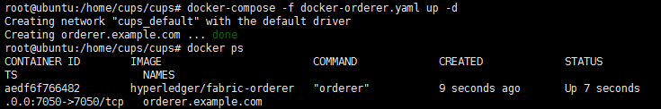

## peer0.org1.com搭建

* docker-peer01.yaml配置文件编写

```shell
version: '2'

services:

  couchdb:
    container_name: couchdb
    image: hyperledger/fabric-couchdb
    ports:
      - "5984:5984"

  ca:
    container_name: ca
    image: hyperledger/fabric-ca
    environment:
      - FABRIC_CA_HOME=/etc/hyperledger/fabric-ca-server
      - FABRIC_CA_SERVER_CA_NAME=ca
      - FABRIC_CA_SERVER_TLS_ENABLED=false
      - FABRIC_CA_SERVER_TLS_CERTFILE=/etc/hyperledger/fabric-ca-server-config/ca.org1.example.com-cert.pem
      - FABRIC_CA_SERVER_TLS_KEYFILE=/etc/hyperledger/fabric-ca-server-config/ab7dca5e5f6b1cc24c2023764c5b34d1f78d8614d2a11e74178d2d5509bd3be8_sk
    ports:
      - "7054:7054"
    command: sh -c 'fabric-ca-server start --ca.certfile /etc/hyperledger/fabric-ca-server-config/ca.org1.example.com-cert.pem --ca.keyfile /etc/hyperledger/fabric-ca-server-config/ab7dca5e5f6b1cc24c2023764c5b34d1f78d8614d2a11e74178d2d5509bd3be8_sk -b admin:adminpw -d'
    volumes:
      - ./crypto-config/peerOrganizations/org1.example.com/ca/:/etc/hyperledger/fabric-ca-server-config

  peer0.org1.example.com:
    container_name: peer0.org1.example.com
    image: hyperledger/fabric-peer
    environment:
      - CORE_LEDGER_STATE_STATEDATABASE=CouchDB
      - CORE_LEDGER_STATE_COUCHDBCONFIG_COUCHDBADDRESS=couchdb:5984

      - CORE_PEER_ID=peer0.org1.example.com
      - CORE_PEER_NETWORKID=cups
      - CORE_PEER_ADDRESS=peer0.org1.example.com:7051
      - CORE_PEER_CHAINCODELISTENADDRESS=peer0.org1.example.com:7052
      - CORE_PEER_GOSSIP_EXTERNALENDPOINT=peer0.org1.example.com:7051
      - CORE_PEER_LOCALMSPID=Org1MSP

      - CORE_VM_ENDPOINT=unix:///host/var/run/docker.sock
      - CORE_LOGGING_LEVEL=DEBUG
      - CORE_VM_DOCKER_HOSTCONFIG_NETWORKMODE=cups_default
      - CORE_PEER_GOSSIP_SKIPHANDSHAKE=true
      - CORE_PEER_GOSSIP_USELEADERELECTION=true
      - CORE_PEER_GOSSIP_ORGLEADER=false
      - CORE_PEER_PROFILE_ENABLED=false
      - CORE_PEER_TLS_ENABLED=false
      - CORE_PEER_TLS_CERT_FILE=/etc/hyperledger/fabric/tls/server.crt
      - CORE_PEER_TLS_KEY_FILE=/etc/hyperledger/fabric/tls/server.key
      - CORE_PEER_TLS_ROOTCERT_FILE=/etc/hyperledger/fabric/tls/ca.crt
    volumes:
        - /var/run/:/host/var/run/
        - ./crypto-config/peerOrganizations/org1.example.com/peers/peer0.org1.example.com/msp:/etc/hyperledger/fabric/msp
        - ./crypto-config/peerOrganizations/org1.example.com/peers/peer0.org1.example.com/tls:/etc/hyperledger/fabric/tls
    working_dir: /opt/gopath/src/github.com/hyperledger/fabric/peer
    command: peer node start
    ports:
      - 7051:7051
      - 7052:7052
      - 7053:7053
    depends_on:
      - couchdb
    networks:
      default:
        aliases:
          - cups
    extra_hosts:
     - "orderer.example.com:192.168.124.72"

  cli:
    container_name: cli
    image: hyperledger/fabric-tools
    tty: true
    environment:
      - GOPATH=/opt/gopath
      - CORE_VM_ENDPOINT=unix:///host/var/run/docker.sock
      - CORE_LOGGING_LEVEL=DEBUG
      - CORE_PEER_ID=cli
      - CORE_PEER_ADDRESS=peer0.org1.example.com:7051
      - CORE_PEER_LOCALMSPID=Org1MSP
      - CORE_PEER_TLS_ENABLED=false
      - CORE_PEER_TLS_CERT_FILE=/opt/gopath/src/github.com/hyperledger/fabric/peer/crypto/peerOrganizations/org1.example.com/peers/peer0.org1.example.com/tls/server.crt
      - CORE_PEER_TLS_KEY_FILE=/opt/gopath/src/github.com/hyperledger/fabric/peer/crypto/peerOrganizations/org1.example.com/peers/peer0.org1.example.com/tls/server.key
      - CORE_PEER_TLS_ROOTCERT_FILE=/opt/gopath/src/github.com/hyperledger/fabric/peer/crypto/peerOrganizations/org1.example.com/peers/peer0.org1.example.com/tls/ca.crt
      - CORE_PEER_MSPCONFIGPATH=/opt/gopath/src/github.com/hyperledger/fabric/peer/crypto/peerOrganizations/org1.example.com/users/Admin@org1.example.com/msp
    working_dir: /opt/gopath/src/github.com/hyperledger/fabric/peer
    volumes:
        - /var/run/:/host/var/run/
        - ./chaincode/:/opt/gopath/src/github.com/hyperledger/fabric/chaincode/
        - ./crypto-config:/opt/gopath/src/github.com/hyperledger/fabric/peer/crypto/
        - ./channel-artifacts:/opt/gopath/src/github.com/hyperledger/fabric/peer/channel-artifacts
    depends_on:
      - peer0.org1.example.com
    extra_hosts:
     - "orderer.example.com:192.168.124.72"
     - "peer0.org1.example.com:192.168.124.70"
```

* 启动 peer0.org1.example.com

```
docker-compose -f docker-peer01.yaml up -d
```

* 检查是否启动成功

```
docker ps
```

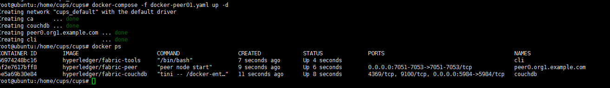

* 进入cli

```
docker exec -it cli bash
```

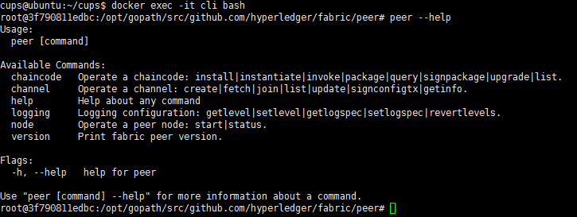

* 生成通道

```shell
peer channel create \
-o 192.168.124.72:7050 \
-c mychannel \
-f ./channel-artifacts/mychannel.tx

# 注意一旦与order断开连接就无法创建channel
# order重启可以解决这个问题

# 之所以使用IP:端口，嗯，我的dns太杂了
```

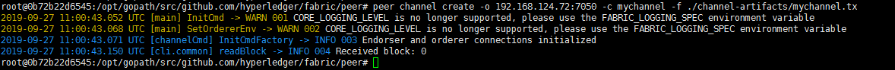

* 加入通道

```
peer channel join -b mychannel.block
```

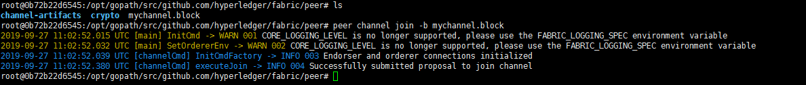

* 安装智能合约

```
peer chaincode install \
-n mychannel \
-p github.com/hyperledger/fabric/chaincode \
-v 1.0 \
-l golang
```

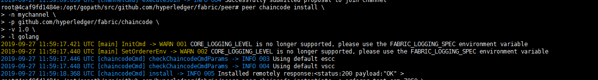

* 实例化channel

```
peer chaincode instantiate \
-o 192.168.124.72:7050 \
-C mychannel \
-n mychannel \
-c '{"Args":["init","A","100","B","100"]}' \
-P "AND ('Org1MSP.member')" \
-v 1.0 \
-l golang
```

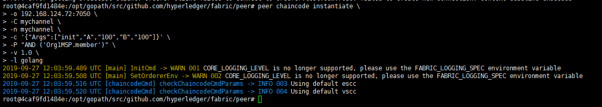

* 查询A、B

```
peer chaincode query \
-C mychannel \
-n mychannel \
-c '{"Args":["query","A"]}'

peer chaincode query \
-C mychannel \
-n mychannel \
-c '{"Args":["query","B"]}'
```

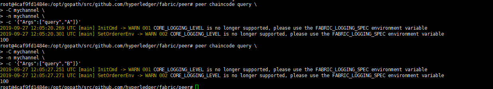

交易

```
peer chaincode invoke \
-C mychannel \
-n mychannel \
-c '{"Args":["invoke","A","B","10"]}'
```

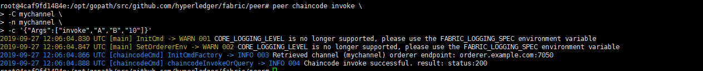

* 查询A、B

```
peer chaincode query \
-C mychannel \
-n mychannel \
-c '{"Args":["query","A"]}'

peer chaincode query \
-C mychannel \
-n mychannel \
-c '{"Args":["query","B"]}'
```


* 把channel文件拿出来备用

```shell
# 退出容器
ctrl + D
# 复制channe文件
docker cp cli:/opt/gopath/src/github.com/hyperledger/fabric/peer/mychannel.block ./
# 其他人加入该channel时需要复制mychannel
```

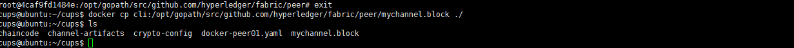

## peer1.org1.com搭建

## peer0.org2.com搭建

- docker-peer02.yaml配置文件编写

```shell
version: '2'

services:

  couchdb:
    container_name: couchdb
    image: hyperledger/fabric-couchdb
    ports:
      - "5984:5984"

  ca:
    container_name: ca
    image: hyperledger/fabric-ca
    environment:
      - FABRIC_CA_HOME=/etc/hyperledger/fabric-ca-server
      - FABRIC_CA_SERVER_CA_NAME=ca
      - FABRIC_CA_SERVER_TLS_ENABLED=false
      - FABRIC_CA_SERVER_TLS_CERTFILE=/etc/hyperledger/fabric-ca-server-config/ca.org2.example.com-cert.pem
      - FABRIC_CA_SERVER_TLS_KEYFILE=/etc/hyperledger/fabric-ca-server-config/638c62f6073cf84d4a897b90fa31c0d53c4c2ffaa0b0be1c3c7df233eb33a27a_sk
    ports:
      - "7054:7054"
    command: sh -c 'fabric-ca-server start --ca.certfile /etc/hyperledger/fabric-ca-server-config/ca.org2.example.com-cert.pem --ca.keyfile /etc/hyperledger/fabric-ca-server-config/638c62f6073cf84d4a897b90fa31c0d53c4c2ffaa0b0be1c3c7df233eb33a27a_sk -b admin:adminpw -d'
    volumes:
      - ./crypto-config/peerOrganizations/org2.example.com/ca/:/etc/hyperledger/fabric-ca-server-config

  peer0.org2.example.com:
    container_name: peer0.org2.example.com
    image: hyperledger/fabric-peer
    environment:
      - CORE_LEDGER_STATE_STATEDATABASE=CouchDB
      - CORE_LEDGER_STATE_COUCHDBCONFIG_COUCHDBADDRESS=couchdb:5984

      - CORE_PEER_ID=peer0.org2.example.com
      - CORE_PEER_NETWORKID=cups
      - CORE_PEER_ADDRESS=peer0.org2.example.com:7051
      - CORE_PEER_CHAINCODELISTENADDRESS=peer0.org2.example.com:7052
      - CORE_PEER_GOSSIP_EXTERNALENDPOINT=peer0.org2.example.com:7051
      - CORE_PEER_LOCALMSPID=Org2MSP

      - CORE_VM_ENDPOINT=unix:///host/var/run/docker.sock
      - CORE_VM_DOCKER_HOSTCONFIG_NETWORKMODE=cups
      - CORE_LOGGING_LEVEL=DEBUG
      - CORE_VM_DOCKER_HOSTCONFIG_NETWORKMODE=cups_default
      - CORE_PEER_GOSSIP_SKIPHANDSHAKE=true
      - CORE_PEER_GOSSIP_USELEADERELECTION=true
      - CORE_PEER_GOSSIP_ORGLEADER=false
      - CORE_PEER_PROFILE_ENABLED=false
      - CORE_PEER_TLS_ENABLED=false
      - CORE_PEER_TLS_CERT_FILE=/etc/hyperledger/fabric/tls/server.crt
      - CORE_PEER_TLS_KEY_FILE=/etc/hyperledger/fabric/tls/server.key
      - CORE_PEER_TLS_ROOTCERT_FILE=/etc/hyperledger/fabric/tls/ca.crt
    volumes:
        - /var/run/:/host/var/run/
        - ./crypto-config/peerOrganizations/org2.example.com/peers/peer0.org2.example.com/msp:/etc/hyperledger/fabric/msp
        - ./crypto-config/peerOrganizations/org2.example.com/peers/peer0.org2.example.com/tls:/etc/hyperledger/fabric/tls
    working_dir: /opt/gopath/src/github.com/hyperledger/fabric/peer
    command: peer node start
    ports:
      - 7051:7051
      - 7052:7052
      - 7053:7053
    depends_on:
      - couchdb
    networks:
      default:
        aliases:
          - cups
    extra_hosts:
     - "orderer.example.com:192.168.124.72"

  cli:
    container_name: cli
    image: hyperledger/fabric-tools
    tty: true
    environment:
      - GOPATH=/opt/gopath
      - CORE_VM_ENDPOINT=unix:///host/var/run/docker.sock
      - CORE_LOGGING_LEVEL=DEBUG
      - CORE_PEER_ID=cli
      - CORE_PEER_ADDRESS=peer0.org2.example.com:7051
      - CORE_PEER_LOCALMSPID=Org2MSP
      - CORE_PEER_TLS_ENABLED=false
      - CORE_PEER_TLS_CERT_FILE=/opt/gopath/src/github.com/hyperledger/fabric/peer/crypto/peerOrganizations/org2.example.com/peers/peer0.org2.example.com/tls/server.crt
      - CORE_PEER_TLS_KEY_FILE=/opt/gopath/src/github.com/hyperledger/fabric/peer/crypto/peerOrganizations/org2.example.com/peers/peer0.org2.example.com/tls/server.key
      - CORE_PEER_TLS_ROOTCERT_FILE=/opt/gopath/src/github.com/hyperledger/fabric/peer/crypto/peerOrganizations/org2.example.com/peers/peer0.org2.example.com/tls/ca.crt
      - CORE_PEER_MSPCONFIGPATH=/opt/gopath/src/github.com/hyperledger/fabric/peer/crypto/peerOrganizations/org2.example.com/users/Admin@org2.example.com/msp
    working_dir: /opt/gopath/src/github.com/hyperledger/fabric/peer
    volumes:
        - /var/run/:/host/var/run/
        - ./chaincode/:/opt/gopath/src/github.com/hyperledger/fabric/
        - ./crypto-config:/opt/gopath/src/github.com/hyperledger/fabric/peer/crypto/
        - ./channel-artifacts:/opt/gopath/src/github.com/hyperledger/fabric/peer/channel-artifacts
    depends_on:
      - peer0.org2.example.com
    extra_hosts:
     - "orderer.example.com:192.168.124.72"
     - "peer0.org2.example.com:192.168.124.67"
```

* 复制org1的channel到./channel-artifacts下

* 启动 peer0.org2.example.com

```
docker-compose -f docker-peer02.yaml up -d
```

- 检查是否启动成功

```
docker ps
```


- 进入cli

```
docker exec -it cli bash
```


- 加入通道

```
peer channel join -b ./channel-artifacts/mychannel.block
```

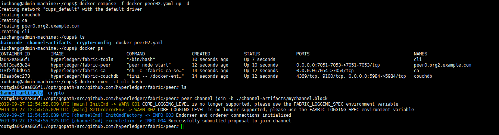

- 安装智能合约

```
peer chaincode install \
-n mychannel \
-p github.com/hyperledger/fabric/chaincode \
-v 1.0 \
-l golang
```


- 查询A、B

```
peer chaincode query \
-C mychannel \
-n mychannel \
-c '{"Args":["query","A"]}'

peer chaincode query \
-C mychannel \
-n mychannel \
-c '{"Args":["query","B"]}'
```


## peer1.org2.com搭建


